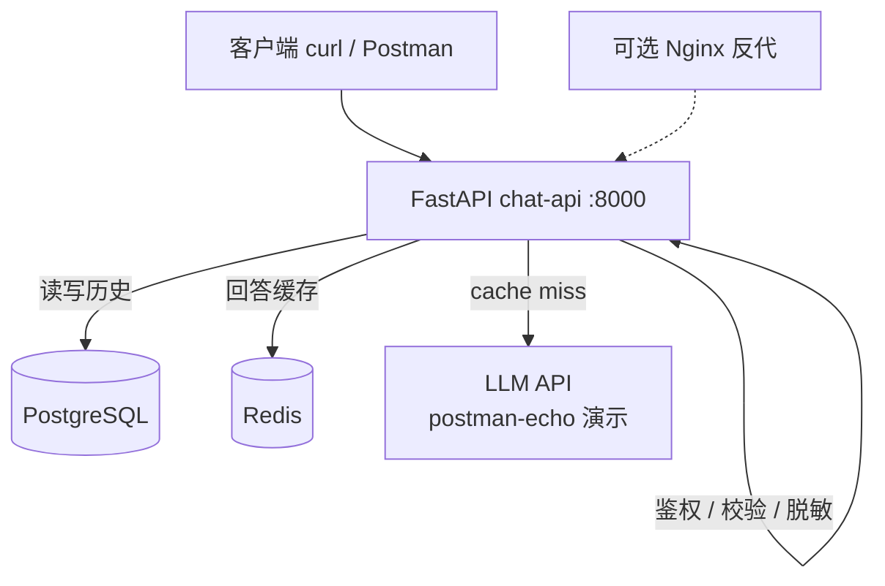
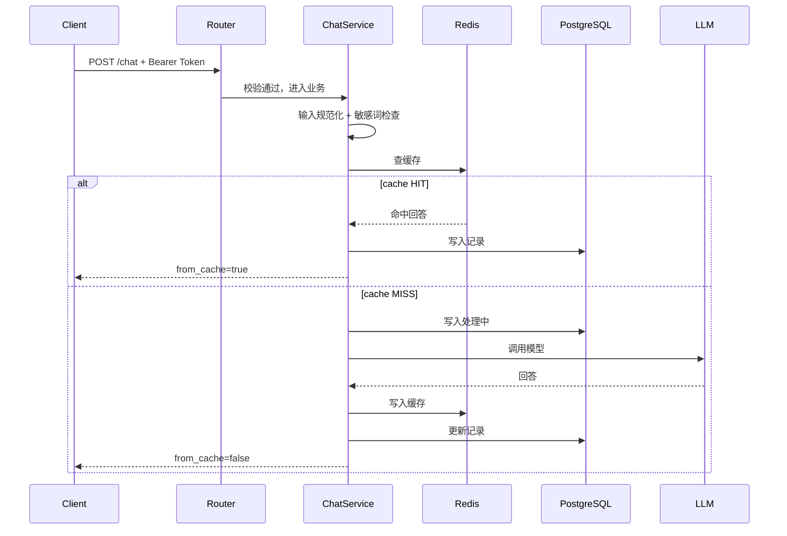

# chat-api

基于 FastAPI 的 LLM 聊天后端服务，支持 Bearer 鉴权、PostgreSQL 历史记录、Redis 回答缓存、输入脱敏与全链路性能日志。

**验收目标**：按本文档操作，新人在 **30 分钟内** 完成启动、调通接口、跑通冒烟测试。

---

## 功能概览

| 能力 | 说明 |
|------|------|
| 聊天 | `POST /chat` 调用 LLM，问答自动入库 |
| 历史 | `GET /history` 按用户分页查询聊天记录 |
| 缓存 | 相同问题 Redis 命中，跳过 LLM 调用 |
| 鉴权 | Bearer Token，未授权返回 401 |
| 输入管控 | 长度限制、敏感词拦截、日志脱敏 |
| 健康检查 | `GET /healthz` 检测 app + PostgreSQL + Redis |
| 可观测 | 每条请求输出 `request_id` 与 cache/llm/db 耗时 |

---

## 架构



### 请求链路（`POST /chat`）



### 目录结构

```text
fastapi_demo/
├── main.py              # 应用入口、全局异常
├── config.py            # 环境变量配置
├── llm_client.py        # LLM 调用（超时重试）
├── routers/             # 路由层
│   ├── ping.py          # GET /ping
│   ├── chat.py          # POST /chat, GET /history
│   └── health.py        # GET /healthz
├── schemas/             # Pydantic 请求/响应模型
├── services/            # 业务逻辑
│   └── chat_service.py  # 缓存 + DB + LLM 编排
├── core/                # 鉴权、日志、Redis、脱敏、性能
├── db/                  # SQLAlchemy 连接
├── models/              # ORM 模型
├── sql/                 # 建表脚本
├── scripts/
│   └── smoke_test.sh    # 冒烟回归测试（12 条）
├── docker-compose.yml   # 一键启动 app + pg + redis
├── .env.example         # 环境变量模板
└── Dockerfile
```

---

## 快速开始（推荐 Docker，约 15 分钟）

### 前置条件

- Docker Desktop 已安装并运行
- 本机 8000 / 5432 / 6379 端口未被占用

### 1. 进入项目目录

```bash
cd fastapi_demo
```

### 2. 配置环境变量

Docker 部署使用 `.env.docker`（已内置演示 Token，可直接启动）：

```bash
# 可选：复制模板自定义本地配置
cp .env.example .env
```

| 变量 | Docker 默认值 | 说明 |
|------|---------------|------|
| `API_TOKEN` | `mytoken123456` | Bearer 鉴权 Token |
| `DB_HOST` | `db` | 容器内 PostgreSQL 服务名 |
| `REDIS_HOST` | `redis` | 容器内 Redis 服务名 |
| `CACHE_TTL_NORMAL` | `1800` | 正常回答缓存秒数 |
| `CACHE_TTL_EMPTY` | `300` | 空值/异常缓存秒数 |

完整变量说明见 [`.env.example`](.env.example)。

### 3. 一键启动

```bash
docker compose up -d --build
```

等待三个容器均为 `healthy`：

```bash
docker compose ps
```

### 4. 验证服务

```bash
# 存活探针
curl http://127.0.0.1:8000/ping

# 全链路健康检查
curl http://127.0.0.1:8000/healthz
```

`healthz` 正常响应示例：

```json
{
  "code": 200,
  "message": "healthy",
  "data": {
    "app": "ok",
    "postgres": "ok",
    "redis": "ok"
  },
  "request_id": "req_abc123"
}
```

### 5. 发一条聊天请求

```bash
curl -X POST http://127.0.0.1:8000/chat \
  -H "Authorization: Bearer mytoken123456" \
  -H "Content-Type: application/json" \
  -d '{
    "user_id": "u001",
    "session_id": "sess_demo_001",
    "message": "储能BMS是什么"
  }'
```

成功响应示例：

```json
{
  "your_msg": "储能BMS是什么",
  "llm_reply": "LLM模型返回：储能BMS是什么",
  "from_cache": false
}
```

### 6. 跑冒烟测试

```bash
./scripts/smoke_test.sh
```

全部 `PASS` 即 D27/D28 验收通过。

### 7. 查看 API 文档（可选）

浏览器打开：http://127.0.0.1:8000/docs

---

## 本地开发启动（不用 Docker）

适合改代码调试，需本机已安装 PostgreSQL 和 Redis。

```bash
cd fastapi_demo
python -m venv .venv
source .venv/bin/activate        # Windows: .venv\Scripts\activate
pip install -r requirements.txt

cp .env.example .env
# 编辑 .env：填好 DB_HOST=127.0.0.1、REDIS_HOST=127.0.0.1、API_TOKEN 等

# 初始化数据库（首次）
psql -U postgres -d fastapi_chat_db -f sql/init.sql

uvicorn main:app --reload --host 0.0.0.0 --port 8000
```

---

## 接口说明

除 `/ping` 外，业务接口均需 Header：

```http
Authorization: Bearer <API_TOKEN>
```

### `GET /ping`

存活检查，无需鉴权。

```bash
curl http://127.0.0.1:8000/ping
# {"ok":true}
```

### `GET /healthz`

检查应用、PostgreSQL、Redis。任一依赖异常返回 HTTP 503。

```bash
curl http://127.0.0.1:8000/healthz
```

### `POST /chat`

发送聊天消息。

**请求体**

| 字段 | 类型 | 约束 |
|------|------|------|
| `user_id` | string | 1–32 字符 |
| `session_id` | string | 10–64 字符 |
| `message` | string | 1–200 字符，自动去首尾空白、合并空格 |

```bash
curl -X POST http://127.0.0.1:8000/chat \
  -H "Authorization: Bearer mytoken123456" \
  -H "Content-Type: application/json" \
  -d '{"user_id":"u001","session_id":"sess_demo_001","message":"你好"}'
```

**成功响应（200）**

```json
{
  "your_msg": "你好",
  "llm_reply": "LLM模型返回：你好",
  "from_cache": false
}
```

相同 `message` 再次请求时，`from_cache` 为 `true`，响应更快。

### `GET /history`

按用户分页查询聊天历史。

| 参数 | 类型 | 说明 |
|------|------|------|
| `user_id` | string | 必填 |
| `page` | int | 页码，≥1，默认 1 |
| `page_size` | int | 每页条数，1–100，默认 10 |

```bash
curl "http://127.0.0.1:8000/history?user_id=u001&page=1&page_size=10" \
  -H "Authorization: Bearer mytoken123456"
```

**成功响应（200）**

```json
{
  "code": 200,
  "message": "查询成功",
  "data": {
    "items": [
      {
        "id": 1,
        "user_id": "u001",
        "session_id": "sess_demo_001",
        "user_content": "你好",
        "ai_content": "LLM模型返回：你好",
        "msg_status": 1,
        "created_at": "2026-06-26T10:00:00"
      }
    ],
    "total": 1,
    "page": 1,
    "page_size": 10,
    "total_pages": 1
  },
  "request_id": "req_abc123"
}
```

`msg_status`：`0` 失败 · `1` 正常 · `2` 处理中

---

## 错误码与统一响应

鉴权失败、参数错误、业务异常均返回统一 JSON：

```json
{
  "code": 401,
  "message": "无效或未提供 Token",
  "data": null,
  "request_id": "req_abc123"
}
```

| HTTP 状态 | 场景 |
|-----------|------|
| 400 | 参数校验失败、空消息、敏感词、业务异常 |
| 401 | 未提供或错误的 Bearer Token |
| 422 | Query 参数不合法（如 `page=0`） |
| 503 | `/healthz` 检测到 DB 或 Redis 不可用 |
| 500 | 未预期服务器错误 |

---

## 分层拦截（输入安全）

| 层级 | 位置 | 拦截内容 |
|------|------|----------|
| 第 1 层 | Pydantic | 超长、超短、类型错误 |
| 第 2 层 | Service | 空值、敏感词 |
| 第 3 层 | 缓存 + LLM | 空回答 / 调用失败 → 短 TTL 标记，不反复打模型 |

日志中对用户内容自动脱敏（手机号、邮箱打码；长文本截断摘要）。

---

## 性能日志

每条请求终端输出 `[PERF]` 行，示例：

```text
[PERF] path=/chat | method=POST | status=200 | total_ms=312.5 | cache_hit=False | cache_ms=2.1 | llm_ms=280.0 | db_ms=15.3 | request_id=req_abc123
```

超过 2000ms 的请求会打 `WARN` 慢请求日志。

---

## 常用运维命令

```bash
# 查看日志
docker compose logs -f web

# 重启
docker compose restart web

# 停止并清理容器（数据卷保留）
docker compose down

# 停止并删除数据卷（慎用）
docker compose down -v
```

---

## 30 分钟跑通检查清单

按顺序打勾，全部完成即 README v1.0 验收通过：

- [ ] `docker compose up -d --build` 三服务 healthy
- [ ] `curl /ping` 返回 `{"ok":true}`
- [ ] `curl /healthz` 三项均为 `ok`
- [ ] `POST /chat` 带 Token 有 LLM 回答
- [ ] 相同问题第二次 `from_cache: true`
- [ ] `GET /history` 能查到刚才的记录
- [ ] `./scripts/smoke_test.sh` 全部 PASS
- [ ] 打开 `/docs` 能看到 Swagger 文档

---

## 技术栈

| 组件 | 版本/说明 |
|------|-----------|
| Python | 3.11+ |
| FastAPI | 0.137 |
| PostgreSQL | 16 |
| Redis | 7 |
| SQLAlchemy | 2.0 |
| httpx | 异步 HTTP 客户端 |

---

## 版本

- **README v1.0** — Phase 0 / 月 1 D28 交付
- **D29 录屏稿** — [docs/D29-chat-api-录屏稿.md](../docs/D29-chat-api-录屏稿.md)
- 下一步：D30 月复盘 + 规划月 2 RAG
