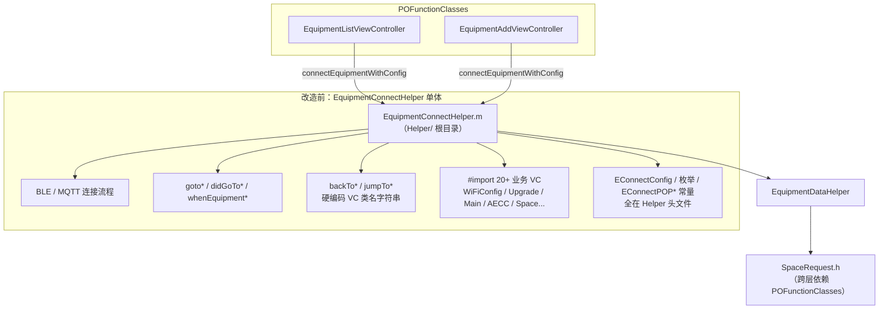
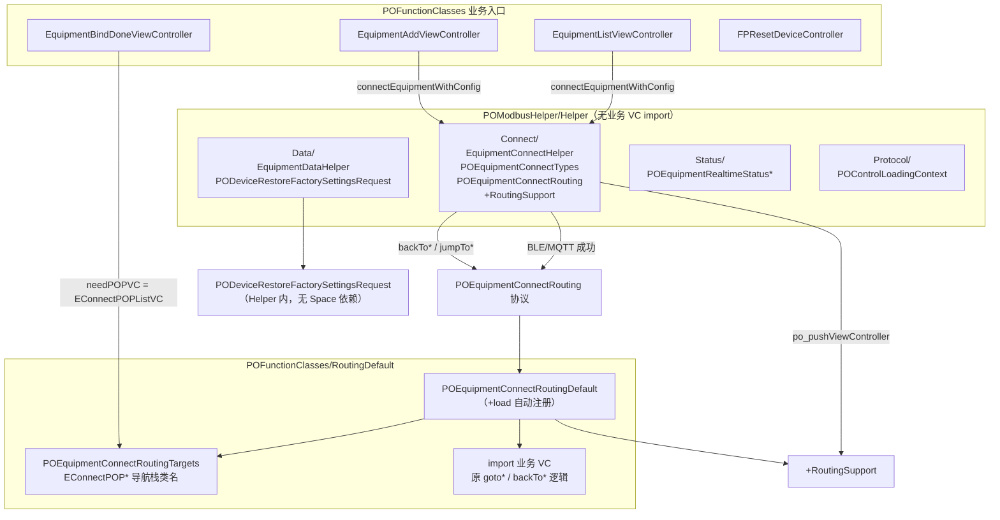
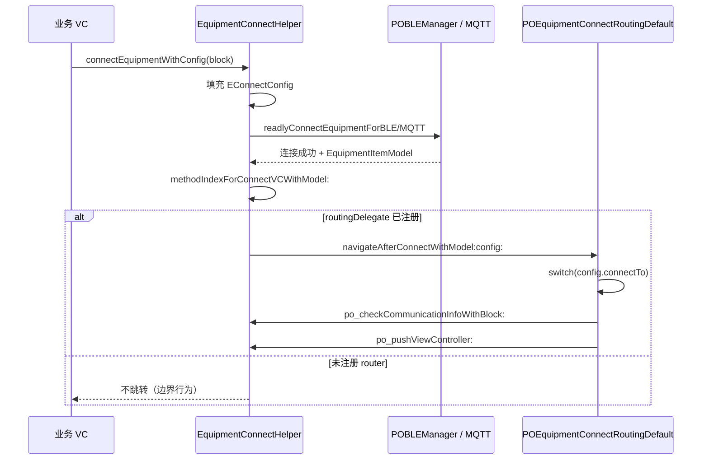
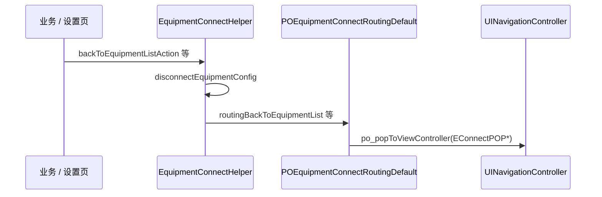
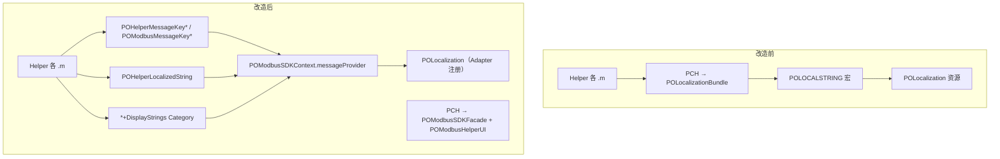

# POModbusHelper 分层改造说明（P0 + P1 + P2-1 ~ P2-4）

> 分支：`Master3.0_POModbus`  
> 面向：维护者、联调与回归测试  
> 关联文档：[POModbusSDK-Architecture.md](./POModbusSDK-Architecture.md) §6.6 / §6.7 / §6.8  
> **使用与扩展**：[08-POModbusSDK-Usage-and-Extension.md](./08-POModbusSDK-Usage-and-Extension.md) · [09-POModbusHelper-Usage-and-Extension.md](./09-POModbusHelper-Usage-and-Extension.md)

---

## 1. 改造范围概览

分阶段目标：**连接留在 Helper，跳转与 UI 反馈逐步下沉或可替换**，消除 Helper 对业务 VC / `POHUB` / `POLocalization` 宏的硬依赖。

| 阶段 | 状态 | 主要内容 |
|------|------|----------|
| **P0** | 已提交 `06613877e` | 稳编、PCH、podspec 依赖补齐、公共头尖括号、`PODeviceRestoreFactorySettingsRequest` 从 `SpaceRequest` 抽出、BLE/协议行为对齐 Master3.0 |
| **P1** | 已提交 `5838ca3fa` | 连接路由协议、`RoutingDefault` 默认实现、Helper 目录重组、`backTo*` 解耦、`EConnectPOP*` 常量迁移 |
| **P2-1** | 工作区（未提交） | Helper 内 Toast/Loading 门面（`POModbusHelperUI` + `POHelperMessageKeys`）；8 个业务文件迁移；Debug 调试页 |
| **P2-2** | 工作区（未提交） | Helper 全量文案脱钩 `POLOCALSTRING`：`POHelperLocalizedString`、Model `+DisplayStrings`、`POModbusMessageKeys` 扩充、key 按域拆分；约 39 文件 / ~580 处替换 |
| **P2-3** | 工作区（未提交） | 控制 Loading：`POControlLoadingContext` 安装；休眠/关机去叠 HUD；`noLoadingOnce` 收敛 |
| **P2-4** | 工作区（未提交） | Helper 日志收敛：`POLog` → `POModbusLog` / `POModbusOTALog`；公开 `PO_OTA_ShouldLog` |

### 1.1 目前使用 vs 未来意义（总览）

| 阶段 | 目前怎么用（Bluetti） | 未来意义（条件满足后） |
|------|----------------------|------------------------|
| **P0** | 照常 `pod install`；Helper 用 PCH；恢复出厂请求在 Helper 内 | 编译边界清晰，DataHelper 不依赖 Space |
| **P1** | 连接仍调 `EquipmentConnectHelper`；跳转由 `POEquipmentConnectRoutingDefault` +load 自动注册；业务 `needPOPVC` 用 `EConnectPOP*` | 自定义 App / 测试可 `registerRoutingDelegate:` 换导航；Helper 无业务 VC import |
| **P2-1** | Bootstrap 后 Toast 仍 POHUB；Helper 8 文件用 `POHelperToast*`；Debug 页可点测 | 与 Core 共用 `uiProvider`；全量迁移后可去 POHUB fallback、弱化 POBase |
| **P2-2** | Helper 内 Alert/展示/枚举文案走 `POModbusLocalizedString`；PCH 不再注入 `POLocalizationBundle` | Helper 与 Core 共用 `messageProvider`；可 mock 文案、CI 门禁 `POLOCALSTRING`；为迁 `POFunctionClasses` 铺路 |
| **P2-3** | 主页/设置页安装 `controlLoadingContext`；休眠/关机等单层 SDK Loading | 与 Core 控制写 HUD 一致；Debug 页可验 debounce / noLoadingOnce |
| **P2-4** | Helper 调试日志走 `configuration` 开关；OTA 三门禁与 SDK 一致 | 联调可 runtime 开关；Helper 无散落 `POLog` |

---

## 2. 架构对比

### 2.1 改造前（单体 Helper）



**痛点**

- Helper 与业务 UI 强耦合，无法单独编译 / 复用连接能力。
- `EquipmentDataHelper` 通过 `SpaceRequest` 间接依赖 Space 模块。
- Pod 子模块之间易出现环依赖（Routing ↔ List ↔ Space）。

---

### 2.2 改造后（连接 + 路由分离）



---

### 2.3 连接成功后的调用链



---

### 2.4 断开 / 回栈调用链



---

## 3. 目录与文件变更对照

### 3.1 Helper 目录重组

| 改造前 | 改造后 | 说明 |
|--------|--------|------|
| `Helper/EquipmentConnectHelper.*` | `Helper/Connect/EquipmentConnectHelper.*` | 连接核心 |
| — | `Helper/Connect/POEquipmentConnectTypes.*` | 从 Helper 抽出枚举与 `EConnectConfig` |
| — | `Helper/Connect/POEquipmentConnectRouting.h` | 导航协议（Helper 定义，业务实现） |
| — | `Helper/Connect/EquipmentConnectHelper+RoutingSupport.*` | push / 密码校验辅助 |
| `Helper/EquipmentDataHelper.*` 等 | `Helper/Data/*` | 数据与功能 Helper |
| `Helper/POEquipmentRealtimeStatus*` | `Helper/Status/*` | 实时状态条 |
| `Helper/POControlLoadingContext.*` | `Helper/Protocol/*` | 控制 Loading 上下文 |

### 3.2 新增 RoutingDefault 子模块

| 文件 | 职责 |
|------|------|
| `POEquipmentConnectRoutingDefault.h/.m` | 默认路由实现；`+load` → `registerAsDefaultRoutingDelegate` |
| `POEquipmentConnectRoutingTargets.h/.m` | `EConnectPOPIndexVC` 等 6 个导航栈类名常量 |

### 3.3 podspec 依赖调整

```
POFunctionClasses/RoutingDefault
  └── 仅依赖 POModbus/POModbusHelper/Helper

POFunctionClasses/CommonSet/Controllers
  └── 新增依赖 RoutingDefault（链入默认路由，打破环依赖）
```

**环依赖修复逻辑**：`RoutingDefault` 不再被 `Space` / `EquipmentList` 反向依赖；由 `CommonSet/Controllers` 统一拉入。

### 3.4 P0 其它改动（已提交）

| 项 | 改动 |
|----|------|
| `POModbusHelper-Prefix.pch` | Helper `.m` 注入 `POModbusSDKFacade` + `POModbusHelperUI`（P2-2 起不再注入 `POLocalizationBundle` / `POLOCALSTRING`） |
| 公共头 import | `EquipmentDataHelper.h` 等改为尖括号 `<POModbus/...>` |
| `PODeviceRestoreFactorySettingsRequest` | 从 `SpaceRequest.h` 迁至 `Helper/Data`，消除跨层依赖 |
| `POBLEManager` / `POProtocolRequest` | 对齐 Master3.0 BLE 与协议队列行为 |

---

## 4. 行为对比（改造前 vs 改造后）

| 场景 | 改造前 | 改造后 | 风险等级 |
|------|--------|--------|----------|
| 连接成功跳转 | Helper 内直接 `push` 各 VC | 转发 `POEquipmentConnectRouting` | 低（逻辑搬迁） |
| 未链入 POFunctionClasses | 同左（Helper 自带跳转） | **无 router 时不跳转** | 中（精简 subspec 需注意） |
| `backTo*` / `jumpTo*` | Helper 内硬编码类名 | `disconnectEquipmentConfig` + router optional 方法 | 低 |
| `needPOPVC` | `NSString *` assign | **`copy`** | 低 |
| 冰箱 deviceType==1 | Helper 内 push `IceboxMainViewController` | **RoutingDefault** 内处理 | 低 |
| `EConnectPOP*` 常量 | 曾在 `EquipmentConnectHelper` / Types | **`POEquipmentConnectRoutingTargets`** | 低（需补 import） |
| 并联升级 `isOwner` 传递 | 原逻辑 | RoutingDefault 显式从 `parallelMainEquipmentItem` 拷贝 | 中（升级页权限） |

---

## 5. 回归测试用例

> 建议主工程：**Bluetti**（`pod install` + Clean Build）  
> 分支：`Master3.0_POModbus`  
> 优先级：**P0 必测** → **P1 路由** → **边界场景**

### 5.1 编译与集成

| # | 用例 | 步骤 | 预期 |
|---|------|------|------|
| C-01 | Pod 安装 | `pod install` 主工程 | 无循环依赖报错 |
| C-02 | Clean Build | Xcode Clean + 全量编译 | 0 error；`RoutingDefault` / `POEquipmentConnectRoutingTargets` 可被引用 |
| C-03 | 默认路由注册 | 启动 App，任意连接入口 | `+load` 已注册，连接成功后能正常跳转（非静默失败） |

### 5.2 连接入口（`connectEquipmentWithConfig`）

| # | 入口 | connectFrom | connectTo | 预期落地页 |
|---|------|-------------|-----------|------------|
| E-01 | 设备列表点击设备 | `EConnectFromCList` | `EConnectToMain`（默认） | 通用主页 / 插座 / AECC / Shelly（按机型） |
| E-02 | 设备列表 → 改 Wi-Fi | `EConnectFromCList` | `EConnectToWiFiConfig` | 普通 WiFi 配网页；SS20/AECC → AECC 配网 |
| E-03 | 设备列表 → 升级 | `EConnectFromCList` / Upgrade | `EConnectToUpgrade` | BLE 升级 / 远程升级页（按协议版本） |
| E-04 | 添加设备绑定完成 | `EConnectFromCBind` | `EConnectToWiFiConfig` | 配网流程 |
| E-05 | 绑定完成 → 系统配置 | — | `EConnectToSystemConfig` | RV 系统配置；失败时 `backToEquipmentList` |
| E-06 | 蓝牙搜索列表 | `EConnectFromBLE` / Public | `EConnectToMain` | 无网直连进主页 |
| E-07 | 远程管理 | `EConnectFromARemote` | 默认 Main | 远程设备主页 |
| E-08 | 安装商列表 | `EConnectFromBList` | Main / Expert | 安装商权限映射正确 |
| E-09 | 安装商 `enterDeviceMainVc` | 蓝牙已在线 | — | 跳过完整连接，直达主页 |
| E-10 | 并联盒子入口 | `EConnectFromParallelModule` | Upgrade / Main | 子机升级页 `isOwner` 与主设备一致 |
| E-11 | 空间设备列表 | `connectFromSpaceDeviceList=YES` | Main | 空间 Tab 内单机不展示「加入 Balco」 |
| E-12 | 冰箱 BLE | peripheral.deviceType==1 | — | `IceboxMainViewController` |
| E-13 | 能控云元件配网 | — | `EConnectToAECCElementWiFiConfig` | AECC WiFi 配置 |
| E-14 | JA12 设置 | 安装商 | `EConnectToJA12` | `EJA12SettingController` + `installResultBlock` |
| E-15 | 仅回调不跳转 | — | `EConnectToCallback` | 执行 `callBackBlock`，无 push |
| E-16 | 磁吸屏 FPS | — | `EConnectToFPS` | 执行 `conectEndBlock`，无 push |

### 5.3 连接渠道

| # | 用例 | 步骤 | 预期 |
|---|------|------|------|
| CH-01 | BLE 连接 | 关网或选蓝牙直连 | 扫描 → 配对 → 协议版本校验 → 密码框（如需）→ 跳转 |
| CH-02 | MQTT 连接 | 有网，设备支持云端 | 云端鉴权 → 数据队列 → 跳转 |
| CH-03 | 无网降级 | 有 `deviceModel` 但不支持云端 | 自动切 `EConnectChannelBLE` |
| CH-04 | 连接失败 | 故意断开 / 错误 SN | Toast 失败；`EConnectToSystemConfig` 失败时回列表 |
| CH-05 | 密码校验 | 设备设连接密码 | `po_checkCommunicationInfoWithBlock` 弹窗后再 push |

### 5.4 导航栈与 `needPOPVC`

| # | 用例 | 配置 | 预期 |
|---|------|------|------|
| N-01 | `needPOPVC` | `EConnectPOPListVC` | push 前先 pop 到设备列表（BindDone / FPReset） |
| N-02 | `needPOPCount` | 整数层数 | 按层数 pop 再 push |
| N-03 | `pushAnimated` | NO | 无动画 push |
| N-04 | 栈中已有主页 | 从子页连接 | `readlyConnectEquipmentMainVC` 不重复 push 同类主页 |

### 5.5 断开与回栈（`backTo*`）

| # | API | 前置导航栈 | 预期 |
|---|-----|------------|------|
| B-01 | `backToEquipmentListAction` | 栈含 `EquipmentListViewController` | pop 到列表；Modbus 队列已清理 |
| B-02 | `backToEquipmentListAction` | 栈无列表 | pop 到 Index + push 列表 |
| B-03 | `jumpToEquipmentListAction` | 在主页 | Index → push 列表 或 直接 push |
| B-04 | `backToEquipmentMainAction` | 通用 / AECC / Shelly 主页在栈中 | pop 到对应主页类名 |
| B-05 | `backToEquipmentMainAction` | 栈无主页 | Index + push `EquipmentMainViewController` |
| B-06 | `backEquipmentAction` | 已登录 | 优先回列表；否则 `popToRoot` |
| B-07 | 任意 `backTo*` | 调用后 | `disconnectEquipmentConfig`：`openType=0`、协议队列关闭 |

### 5.6 P0 数据层（已提交部分）

| # | 用例 | 预期 |
|---|------|------|
| D-01 | 并联盒子恢复出厂 | `PODeviceRestoreFactorySettingsRequest` 请求正常，不依赖 Space 模块编译 |
| D-02 | `EquipmentDataHelper` 公共 API | 外部 `#import <POModbus/EquipmentDataHelper.h>` 不报缺头 |
| D-03 | Helper PCH | `POMODBUSIMAGE` / `POHelperLocalizedString` 在 Helper `.m` 可用；`rg POLOCALSTRING POModbusHelper` 为 0 |
| D-04 | BLE Master3.0 对齐 | 连接超时、重连、协议队列与 Master3.0 一致（对比真机日志） |

### 5.7 边界与自定义路由

| # | 用例 | 步骤 | 预期 |
|---|------|------|------|
| X-01 | 自定义 router | `[EquipmentConnectHelper registerRoutingDelegate:mock]` | 默认跳转被替换；可单测 |
| X-02 | 未注册 router | 仅链 Helper 子 spec | 连接成功不 crash，但不 push |
| X-03 | optional 未实现 | mock 不实现 `routingBackTo*` | `backTo*` 仅 disconnect，不导航 |

### 5.8 P2-2 文案回归（Helper）

| # | 场景 | 预期 |
|---|------|------|
| L-01 | 冷启动后进设备 | Toast / Alert 为正常译文，非 raw key |
| L-02 | BLE 搜索超时 / 离线弹窗 | 连接相关文案正常（`POHelperMessageKeys+Connect`） |
| L-03 | 主页全局状态条 | 同步中 / 完成 / 通信恢复文案正常 |
| L-04 | OTA 升级失败 / 无包 | 升级错误文案正常 |
| L-05 | 休眠 / 恢复出厂 | Device 域 Toast 正常 |
| L-06 | 设备详情 error 码 / 固件类型名 | Category / `POModbusFirmwareTypeDisplayName` 展示正常 |
| L-07 | 工作模式 / 国家枚举列表 | `EquipmentFunctionHelper` 配置项文案正常 |
| L-08 | 设置页控制写 / 休眠开关 / 关机 | `controlLoadingContext` 单层 Loading，无 Helper 叠 HUD；Debug 见 **§10.2.1** |
| L-09 | Helper 日志 channel | Debug P2-4 Section：开 `enableBLELog` 后扫描日志进 AppLog；OTA 三门禁与 SDK 一致 |

---

## 6. 建议测试顺序（冒烟 30 分钟）

1. **C-01 ~ C-03** 编译与启动  
2. **E-01** 列表进主页（BLE + MQTT 各一次）  
3. **E-02 / E-03** Wi-Fi 与升级快捷入口  
4. **E-04 / E-05** 添加绑定与系统配置  
5. **B-01 ~ B-05** 设置页退出、解绑、恢复出厂触发的回栈  
6. **E-10** 并联升级（权限按钮）  
7. **E-12** 冰箱（若有设备）  
8. **L-01 ~ L-04** P2-2 文案抽测（连接 / 状态条 / OTA）

---

## 7. 未完成项（非本次必测）

| 项 | 说明 |
|----|------|
| **P2-5** `POFunctionClasses` 文案 | 列表 / 设置页 / `UIView+SearchAndPush` 等仍大量 `POLOCALSTRING`；可复用 `scripts/migrate_polocalstring.py` |
| **P2-4 后续** Helper PCH 减 `POGlobalConfig` | 日志已收敛；Interface 仍依赖 `POBASECONFIG` 可局部 import |
| 去掉 Helper PCH 中 `POToast` | 待全量迁移且去掉 `POModbusHelperUI.m` 内 POHUB fallback |
| P2-2 Tier 2 升格 | `POHelperLocalizedString(@"…")` 可按域逐步升为 `POHelperMessageKey*` 命名常量 |
| P1-4 `EquipmentDataHelper` 进一步解耦 | `EquipmentSetHelper` 外迁、`POEquipmentDataSideEffects` 协议 |
| `UIView+SearchAndPush` 重复 `backTo*` | 可收敛到 `EquipmentConnectHelper` |
| 去掉 `+load` 自动注册 | 改 AppDelegate 显式 `registerAsDefaultRoutingDelegate` |
| 精简 App 仅 Helper | 需自行实现 `POEquipmentConnectRouting` |

---

## 8. P2-1 Toast 门面

### 8.1 范围（当前）

| 已改 | 未改 |
|------|------|
| `POModbusHelper/` 内 8 个业务 `.m` | `POFunctionClasses` 仍直连 `POHUB` |
| `POModbusHelperUI` + `POHelperMessageKeys` | Helper PCH 仍 `#import <POBase/POToast.h>` |
| `POHelperDismissLoading` / Top 仍 fallback `POHUB` | P2-2 已迁 Helper 内 Alert/展示文案；Toast 路径仍见 §8 |

**已迁移文件（P2-1）**：`EquipmentConnectHelper`、`+RoutingSupport`、`BLEEquipmentSearchHelper`、`EquipmentDataHelper`、`EquipmentCloseView`、`BLEUpgradeProgressView`、`EquipmentSpeechView`、`POModbusLogsView`。

### 8.2 当前怎么用（Bluetti / 主工程）

1. **启动**：`[POModbusSDKBootstrap registerDefaultProviders]`（与 P0 一致），`uiProvider` = `POModbusToastUIProvider` → 实际仍是 **POHUB**。
2. **业务侧**：固定文案用 key 常量 + 短函数；Alert / 展示文案见 **§9 P2-2**：

```objc
#import <POModbus/POModbusHelperUI.h>

POHelperToast(POHelperMessageKeyBLEOff);
POHelperLoading(POHelperMessageKeyBLESearching);
POHelperDismissLoading();
POHelperToastDelayed(POHelperMessageKeyCloseSuccess);
POHelperShowOffline();
POHelperToastTextDelayed(failedReason);

// P2-2：Alert / 枚举 / Model 展示
POHelperLocalizedString(@"E_workMode_P_item4");
POModbusLocalizedString(POHelperMessageKeyListOffline);
POModbusLocalizedString(POModbusMessageKeyFirmwareARM);
```

3. **文案 key**：`POHelperMessageKeys+*.h` 按域拆分（Connect / Status / Upgrade / Device）；聚合头 `POHelperMessageKeys.h` 向后兼容。SDK 侧见 `POModbusMessageKeys`。
4. **双轨**：同一场景若走 `UIView+SearchAndPush`（未迁），仍用旧 `POHUB` / `POLOCALSTRING`，与 Helper 路径表现应一致但实现不同。


### 8.3 改造的未来意义（诚实版）

| 维度 | 现在（Bluetti） | 未来（条件满足后） |
|------|----------------|-------------------|
| 用户体验 | 几乎无感，仍 POHUB | 宿主可换 Toast / Loading 皮肤 |
| 依赖 | Helper 业务不直接 `POHUB`（门面内仍有 fallback） | 去掉 fallback 后可弱化对 POBase 依赖 |
| 维护 | ~60 处 Toast 收成统一 API + key 表 | 改 Loading 超时、离线策略、埋点只改 `POModbusHelperUI.m` |
| SDK 化 | 与 Core 同走 `POModbusUIProviding` | 第三方 App 注入 `uiProvider`，Helper 无改 |
| 测试 | 可 mock `uiProvider` 单测门面 | 全仓无漏网 `POHUB` 后回归更简单 |

**一句话**：P2-1 是 **Helper 层的插槽 + 集中管理**，不是终点；价值在 **可替换、可维护、与 SDK 对齐**，不在 Bluetti 立刻可见的行为变化。

### 8.4 P2-1 回归要点

| 优先级 | 场景 |
|--------|------|
| 必测 | 蓝牙关/未授权、扫描 Loading、连接失败 Delayed、列表离线、关机成功/失败、休眠/恢复出厂 Loading |
| 注意双轨 | 列表点设备若走 `UIView+SearchAndPush`，与 `EquipmentConnectHelper` 对比行为 |
| 不必本 PR 测 | `POFunctionClasses` 内 POHUB、自定义 uiProvider（除非做第三方验证） |

完整用例见 **§5 回归测试** 与 **§10 调试工具**；亦可使用 Debug 页逐条点击。

---

## 9. P2-2 文案迁移（Helper 全量）

### 9.1 目标与结果

| 指标 | 改造前 | 改造后 |
|------|--------|--------|
| Helper 内 `POLOCALSTRING` | 全模块散布（Model / Helper / Upgrade / Interface） | **≈ 0**（仅 `POModbusHelperUI.h` 注释提及） |
| 本地化入口 | PCH 隐式注入 `POLocalizationBundle` 宏 | `POModbusLocalizedString` → `messageProvider` |
| Model 展示 | `EquipmentDataModel.m` 内嵌 ~200 行文案方法 | `*+DisplayStrings` Category + `POModbusFirmwareTypeDisplay` |
| 改动规模 | — | 29 修改 + 10 新增；净删 ~250 行 |

### 9.2 架构（改造前 → 改造后）



### 9.3 三层文案策略

| 层级 | API | 适用场景 | 约 |
|------|-----|----------|-----|
| **Tier 1** | `POModbusLocalizedString(POHelperMessageKey*)` | Toast / Alert / 连接 / OTA 等高频、跨文件 key | ~50 |
| **Tier 2** | `POHelperLocalizedString(@"E_xxx")` | 枚举项、国家名、工作模式等大量一次性 key | ~530 |
| **Tier 3** | `*+DisplayStrings` / `POModbusFirmwareTypeDisplayName` | 模型派生、动态 key（`E_Error_%ld`） | Model 层 |

```objc
// POModbusHelperUI.h
NS_INLINE NSString *POHelperLocalizedString(NSString *key) {
    return POModbusLocalizedString(key);
}
```

**设计取舍**：不为 400+ 处各建命名常量；高频可审计、低频统一入口、模型聚合 Category。

### 9.4 按批次改动

| 批次 | 范围 | 要点 |
|------|------|------|
| **2a** | Model | `EquipmentDataModel+DisplayStrings`、`EquipmentItemModel+DisplayStrings`、`POModbusFirmwareTypeDisplay`；`POModbusMessageKeys` 补固件类型 / 设备状态 key |
| **2b** | Connect + Status | `EquipmentConnectHelper` Alert；`POEquipmentRealtimeStatus*` 全局状态条 |
| **2c** | Upgrade + Interface | `BLEUpgradeOTAHelper` 等；`EquipmentCloseView` / `FactoryReset` / `Speech` |
| **2d** | Data Helper | `EquipmentDataHelper`、`EquipmentAuthenticaHelper`、`+GridRatedPower` |
| **2e** | Function Helper | `EquipmentFunctionHelper.m`（~398 处，机械替换为主） |

### 9.5 `POHelperMessageKeys` 按域拆分

```
POHelperMessageKeys.h              ← 聚合头（#import 下面四个）
├── POHelperMessageKeys+Connect.h  ← BLE / 离线 / 配网弹窗（20）
├── POHelperMessageKeys+Status.h   ← 全局连接状态条（4）
├── POHelperMessageKeys+Upgrade.h  ← OTA（1，可扩展）
└── POHelperMessageKeys+Device.h   ← 关机 / 休眠 / 恢复出厂（10）
```

实现仍集中在 **`POHelperMessageKeys.m`**（单 `.m` + `#pragma mark` 分区）。业务可按域 `#import <POModbus/POHelperMessageKeys+Connect.h>` 减少依赖。

### 9.6 PCH 变更

```diff
- #import <POLocalization/POLocalizationBundle.h>
+ #import <POModbus/POModbusSDKFacade.h>
+ #import "POModbusHelperUI.h"
```

所有 Helper 编译单元默认具备 `POHelperLocalizedString` 与 SDK 本地化能力；**不再**隐式注入 `POLOCALSTRING`。

### 9.7 新增文件清单

| 文件 | 职责 |
|------|------|
| `POModbusFirmwareTypeDisplay.*` | OTA / 升级列表固件类型名共用 |
| `EquipmentDataModel+DisplayStrings.*` | error、时间、网络 / MQTT / Mesh / BMS 状态展示 |
| `EquipmentItemModel+DisplayStrings.*` | `padTANT*TypeName` 等设备信息展示 |
| `POHelperMessageKeys+Connect/Status/Upgrade/Device.h` | 命名 key 按域声明 |
| `scripts/migrate_polocalstring.py` | 批量 `POLOCALSTRING` → `POHelperLocalizedString` / 命名常量（可复用于 P2-5） |

### 9.8 改造前 vs 改造后

| 维度 | 改造前 | 改造后 |
|------|--------|--------|
| 依赖 | Helper 直接绑 `POLocalization` 宏 | Helper 只认 SDK `messageProvider` |
| 与 Core | SDK 用 `POModbusLocalizedString`，Helper 用 `POLOCALSTRING` | 统一一条链路 |
| Model | 数据与展示混在 `.m` | Category 分离 |
| 审计 | 宏展开难 grep | Tier 1 可清单化；CI 可门禁 `POLOCALSTRING` |
| 维护 | 固件类型 switch 重复 | `POModbusFirmwareTypeDisplayName` 一处 |

### 9.9 风险与回归要点

| 点 | 说明 | 建议验证 |
|----|------|----------|
| 运行时 | 须 Bootstrap 注册 `messageProvider`，否则回传 key 原文 | 冷启动后抽几条文案 |
| PCH 面 | 所有 Helper 子模块编译行为变化 | Example + Bluetti 全量编译 |
| 未 add 新文件 | Category / `+*.h` 未纳入版本库会链接失败 | 提交前 `git add` 全部新增 |
| Tier 2 | 字面量 key 审计弱于 Tier 1 | 可选逐步升格为命名常量 |
| 双轨 | `POFunctionClasses` 仍 `POLOCALSTRING` | 连接 / OTA / 休眠 / 恢复出厂 / 状态条抽测 |

### 9.10 建议 commit 拆分（可选）

1. **P2-2a**：Model + `POModbusMessageKeys` 扩充  
2. **P2-2b～e**：Helper / Upgrade / Interface 文案替换 + PCH + `POHelperLocalizedString` + key 按域拆分  

### 9.11 批量迁移脚本 `scripts/migrate_polocalstring.py`

P2-2 在 `EquipmentFunctionHelper.m` 等文件中有 **500+ 处** 机械替换，用手写或 IDE 替换易漏。脚本用于 **批量** 把 `POLOCALSTRING` 换成 P2-2 新 API。

#### 扫描范围

默认只处理：

```
POModbus/Classes/POModbusHelper/**/*.m
```

不扫 `.h`、不扫 `POFunctionClasses`（P2-5 需改脚本内 `ROOT` 或复制一份再跑）。

#### 替换规则

| 原写法 | 替换后 | 说明 |
|--------|--------|------|
| `POLOCALSTRING(@"E_List_offline")` | `POModbusLocalizedString(POHelperMessageKeyListOffline)` | key 在脚本 `NAMED` 映射表内 → **Tier 1 命名常量** |
| `POLOCALSTRING(@"Mode_auto_title")` | `POHelperLocalizedString(@"Mode_auto_title")` | 不在映射表 → **Tier 2 字面量** |
| `POLOCALSTRING(eType)` | `POHelperLocalizedString(eType)` | 参数为变量（如 OTA 动态 type key） |

同时删除文件中的：

```objc
#import <POLocalization/POLocalizationBundle.h>
```

#### `NAMED` 映射表

脚本顶部 `NAMED: dict` 维护 **高频 key → 常量名**（约 30 条），例如：

- Helper：`E_List_offline` → `POHelperMessageKeyListOffline`
- Helper：`Upgrade_download_noFile` → `POHelperMessageKeyUpgradeNoFile`
- SDK：`Config_Tips_timeoutTips` → `POModbusMessageKeyTimeoutTips`

**新增 Tier 1 key 时**：先在 `POHelperMessageKeys` / `POModbusMessageKeys` 声明常量，再把 `"资源key": "常量名"` 加进 `NAMED`，重跑脚本或手工对齐。

#### 用法

在仓库根目录（含 `scripts/` 与 `POModbus/`）执行：

```bash
python3 scripts/migrate_polocalstring.py
```

示例输出：

```
Classes/POModbusHelper/Helper/Data/EquipmentFunctionHelper.m: 398
...
Done: 582 replacements in 12 files
```

#### 脚本**不会**做的事

| 不处理 | 说明 |
|--------|------|
| `POLOCALSTRINGREMARK` | 需单独改为 `POHelperLocalizedString` 或命名 key |
| 注释里的 `POLOCALSTRING` | 正则只匹配调用形式，注释一般不动 |
| PCH / podspec | 需人工改 `POModbusHelper-Prefix.pch` |
| 编译验证 | 跑完后必须 Xcode 全量编译 + 抽测 |
| 已迁移目录 | Helper 内已无 `POLOCALSTRING` 时再跑通常 **0 文件** |

#### 用于 P2-5（POFunctionClasses）的建议步骤

1. 复制脚本或增加 CLI 参数 `--root POModbus/Classes/POFunctionClasses`（当前版需改 `ROOT` 变量）。
2. 视情况扩展 `NAMED`（FunctionClasses 专用 key 可先大量走 Tier 2）。
3. `git diff` 人工 review，重点看 `stringWithFormat:`、多语言拼接。
4. 全量编译 Bluetti；CI 可加：`rg POLOCALSTRING POModbusHelper` 必须为 0。

#### 与三层策略的关系

```
POLOCALSTRING(@"key")
        │
        ├─ key ∈ NAMED ──► POModbusLocalizedString(POHelperMessageKey*)
        │
        └─ 其他 ────────► POHelperLocalizedString(@"key")
```

Model 层 `*+DisplayStrings`、PCH 注入 **不能** 靠脚本生成，需按 9.4 批次单独改。

### 9.12 P2-3 控制 Loading（`controlLoadingContext` 落地）

#### 机制现状（改造前）

| 层 | 状态 |
|----|------|
| **Core** | `EBaseProtocol.loadingWhenControlAction` → `uiProvider`；`ESettingRequest` 等控制写已接入 |
| **Helper** | `POControlLoadingContext`（`defaultContext`：1.5s / debounce 0.25s） |
| **业务 VC** | 未设置 `POPROTOCOLREQUEST.controlLoadingContext` |
| **Helper 重复** | `EquipmentDataHelper` 休眠/关机等手写 `POHelperLoading`，且 `setEquipmentCloseModeWithType` / `setChargeCloseModeWithType` 曾设 `noLoadingOnce` 跳过 SDK |

#### 改造要点

| 批次 | 文件 | 工作 |
|------|------|------|
| **A** | `EMainBaseViewController.m` | `viewWillAppear` → `POHelperInstallDefaultControlLoadingContext()`（覆盖 `EquipmentMainViewController`、`SocketMainViewController` 等） |
| **A** | `ESetBaseViewController.h/.m` | 同上（覆盖 `EquipmentSettingViewController` 及设置子页） |
| **B** | `ESettingRequest.m` / `EChargeBoxRequest.m` | 去掉 `setEquipmentCloseModeWithType` / `setChargeCloseModeWithType` 的 `noLoadingOnce`，走 `loadingWhenControlAction` |
| **B** | `EquipmentDataHelper.m` | 控制写前 `POHelperPrepareControlLoading(key)`，删除重叠的 `POHelperLoading`；**读** PV/Grid 校验、恢复出厂前读平台等仍保留 `POHelperLoading` |
| **C** | `POModbusHelperUI.h/.m` | 新增 `POHelperInstallDefaultControlLoadingContext` / `POHelperPrepareControlLoading` |
| **C** | `06-ControlLoading-CustomSpec.md` | 验收参考（逻辑通常不改） |

`SpaceTabBarController` 可选：空间 Tab 内若发起 Modbus 控制写再补装 context。

#### API 用法

```objc
// 业务 VC（已在 EMain / ESet 基类 viewWillAppear）
POHelperInstallDefaultControlLoadingContext();

// Helper：紧挨控制写之前（勿再 POHelperLoading）
POHelperPrepareControlLoading(POHelperMessageKeySleepStateSleep);
[POPROTOCOLREQUEST setEquipmentCloseModeWithType:sleepCode];

// 仅转圈
POHelperPrepareControlLoading(nil);
[POPROTOCOLREQUEST setEquipmentCloseModeWithType:1];
```

#### 与 `POHelperLoading` 的分工

| 场景 | API |
|------|-----|
| Modbus **控制写**（`loadingWhenControlAction`） | `POHelperPrepareControlLoading` + Request |
| **读**请求等待、BLE 扫描、连接流程 | 仍用 `POHelperLoading` |
| CT 检测等业务自管 Loading | `noLoadingOnce`（见 `EAdvancedSetBaseViewController`） |

#### 回归（§5.8 L-08）

设置页任意开关、休眠/唤醒、真关机 → 单层 Loading（1.5s 默认），无 `POHelperLoading` 叠 HUD。

#### 9.12.1 改造前问题（为何要改）

Core 已有 `loadingWhenControlAction`（队列节流 + HUD），但存在三条并行路径：

| 路径 | 行为 | 问题 |
|------|------|------|
| 设置页 `setGridControl:` 等 | SDK 默认 Loading | 正常 |
| `setEquipmentCloseModeWithType:` | 曾设 `noLoadingOnce` → SDK **跳过** | Helper 再 `POHelperLoading` → **双层或行为不一致** |
| 读 PV/Grid / BLE 扫描 | 仅 `POHelperLoading` | 合理，不应并入 P2-3 |

典型改造前代码：

```objc
// ESettingRequest — 故意跳过 SDK
self.noLoadingOnce = YES;
[self setBaseProtocol:Modbus_EquipmentClose content:value];

// EquipmentDataHelper — Helper 再弹
[POPROTOCOLREQUEST setEquipmentCloseModeWithType:sleepCode];
POHelperLoading(POHelperMessageKeySleepStateSleep);
```

#### 9.12.2 SDK 调用链（改造后）

```text
POHelperPrepareControlLoading(key)     ← 一次性文案写入 controlLoadingWillPresent
        ↓
[POPROTOCOLREQUEST setXXX]           ← ESettingRequest / setBaseProtocol
        ↓
loadingWhenControlAction
        ├─ noLoadingOnce? → return
        ├─ queueSleepInterval = 1.0s（节流）
        ├─ showsHUD == NO → 仅节流
        ├─ debounce 0.25s 去重
        ├─ controlLoadingWillPresent（用后 nil）
        └─ uiProvider showControlLoading*（默认 1.5s）
```

`POPROTOCOLREQUEST` 单例上的配套 API 见 `POControlLoadingState.h`、`06-ControlLoading-CustomSpec.md`。

#### 9.12.3 改造前后对比（休眠）

| | 改造前 | 改造后 |
|--|--------|--------|
| SDK | `noLoadingOnce` → 无节流、无 HUD | `loadingWhenControlAction` 正常 |
| Helper | `POHelperLoading` 叠一层 | `POHelperPrepareControlLoading` + `setXXX`，**不叠** |
| 与设置页开关 | 行为不一致 | 同一条 uiProvider 链路 |

#### 9.12.4 改动文件清单

| 文件 | 改动 |
|------|------|
| `POModbusHelperUI.h/.m` | `POHelperInstallDefaultControlLoadingContext` / `POHelperPrepareControlLoading` |
| `EMainBaseViewController.m` | `viewWillAppear` 安装 context |
| `ESetBaseViewController.h/.m` | 同上 |
| `ESettingRequest.m` | `setEquipmentCloseModeWithType:` 去掉 `noLoadingOnce` |
| `EChargeBoxRequest.m` | `setChargeCloseModeWithType:` 去掉 `noLoadingOnce` |
| `EquipmentDataHelper.m` | 控制写改 Prepare + set；读路径保留 `POHelperLoading` |
| `POHelperUIDebugViewController.*` | P2-3 调试 Section（§10.2.1） |

#### 9.12.5 真机回归（L-08 详表）

| # | 操作 | 预期 |
|---|------|------|
| L-08-1 | 设置页任意开关 | 单层转圈 ~1.5s |
| L-08-2 | 休眠（确认后） | 单层 + 「休眠」文案 |
| L-08-3 | 休眠唤醒 | 单层 + 「开机」文案 |
| L-08-4 | 真关机 | 单层转圈 |
| L-08-5 | 快速连点同一开关 | 0.25s debounce，不连弹多个 HUD |
| L-08-6 | CT 检测（高级设置） | 仍 `noLoadingOnce` + 业务 Loading，不受影响 |
| L-08-7 | 关前读 PV/Grid 的设备 | 读时出现 `POHelperLoading`；关指令本身仍为 SDK 单层 |

| 失败现象 | 可能原因 |
|----------|----------|
| 显示 raw key | 未 `registerDefaultProviders` |
| 完全无 Loading | uiProvider 未实现 `showLoading*` |
| 双层 HUD | 仍有 `POHelperLoading` 叠在 `setXXX` 后 |
| 设置页无 Loading | 未进 EMain/ESet 栈，context 未安装 |

#### 9.12.6 与 P2-2 的关系

P2-2 提供文案 key（如 `POHelperMessageKeySleepStateSleep`）；P2-3 通过 `POHelperPrepareControlLoading` 把这些 key 送进 **SDK 控制 Loading**，不再用 `POHelperLoading` 重复弹。

### 9.13 P2-4 日志与配置收敛（Helper）

#### 目标

Helper 调试日志统一走 `POModbusSDKContext.configuration` + `POModbusLog` / `POModbusOTALog`，不再散落 `POLog`。

#### 已完成（Helper）

| 文件 | 改动 |
|------|------|
| `Upgrade/*OTAHelper.m` | `POLog` → `POModbusOTALog`（受 `PO_OTA_ShouldLog`：非 PRO + Logs DB + `enableModbusOTALog`） |
| `EquipmentConnectHelper.m` | 已有 `POModbusLogChannelBLE` |
| `EquipmentDataHelper.m` | 队列 `ModbusData` + 重连 `BLE`；无裸 `POLog` |
| `BLEEquipmentSearchHelper.m` | 扫描生命周期 `POModbusLogChannelBLE` |
| `EquipmentSpeechView.m` | 语音识别 `POModbusLogChannelSDK` |
| `POModbusSDKLog.h` | 公开 `PO_OTA_ShouldLog` / `POModbusOTALog`；`EOTARequest` 复用 |

#### API

```objc
POModbusLog(POModbusLogChannelBLE, @"scan start");
POModbusOTALog(@"[BLE OTA] start …");  // OTA 专用三门禁
POModbusSDKContext.shared.configuration.enableBLELog = YES;
```

#### 未动 / 后续

- `POModbusHelper-Prefix.pch` 仍 `#import POGlobalConfig`（Interface 的 `POBASECONFIG` 布局/Alert）
- `POFunctionClasses` 日志不在本批

---

## 10. 调试工具（仅 `#if DEBUG` 编译）

Release 包不含以下代码；入口与调试页均在 `#if DEBUG` 内。

### 10.1 入口（设备设置页导航栏）

在 **`EquipmentSettingViewController`** 的 `viewDidLoad`（`#if DEBUG`）插入导航按钮：

| 按钮 | 目标 VC | 作用 |
|------|---------|------|
| **Helper UI** | `POHelperUIDebugViewController` | P2-1 Toast/Loading（经 `POModbusToastUIProvider`）+ **P2-2 文案** + **P2-3 控制 Loading** |
| **Route** | `POEquipmentConnectRoutingDebugViewController` | P1 连接路由 + **P2-2 Connect Alert** 真弹窗 |

**路径**：主页 → 设置 → **DEBUG 包** 导航栏右侧可见 **Helper UI** / **Route**（Release 不编入）。

实现文件：`POFunctionClasses/EquipmentSetting/Controllers/EquipmentSettingViewController.m`。

### 10.2 `POHelperUIDebugViewController`

**路径**：`POModbusHelper/Helper/Protocol/POHelperUIDebugViewController.*`

按 **源文件 / 域** 分 Section，Cell 副标题为 API 或 key，点击执行对应调用。

| Section 示例 | 覆盖 |
|--------------|------|
| EquipmentConnectHelper · Toast | P2-1 `POHelperToast*` / Loading |
| EquipmentConnectHelper · Alert 文案 | P2-2 `POHelperMessageKeys+Connect` |
| POEquipmentRealtimeStatus* | P2-2 `+Status`、Session 离线文案 |
| EquipmentDataHelper / CloseView / Upgrade / Interface | P2-1 + P2-2 |
| Model · DisplayStrings / Firmware | Tier 3 + `POModbusMessageKeys` 抽样 |
| **P2-3 · controlLoadingContext** | `Install` / `Prepare` + `loadingWhenControlAction`；debounce / `showsHUD` / `noLoadingOnce` 对照；与 `POHelperLoading` 路径对比 |
| **P2-4 · POModbusLog** | 各 channel 样例日志、`enableBLELog` 开关、configuration 摘要 |
| EquipmentDataHelper · Sleep/Close Alert | Tier 2 休眠/关机/恢复出厂弹窗文案 |
| EquipmentAuthenticaHelper | 认证国家/电网区域文案抽样 |

**Loading 行为（DEBUG 专用）**

- `POHelperLoading` 项、`P2-3` 控制 Loading 模拟项：展示后 **3 秒** 自动 `POHelperDismissLoading`。
- P2-3 模拟路径：`POHelperInstallDefaultControlLoadingContext` → `POHelperPrepareControlLoading` → `[POPROTOCOLREQUEST loadingWhenControlAction]`（**不写寄存器**，与设置页 HUD 渲染同路径）。
- 仍保留各 Section 手动「关闭 Loading」项。

**前置条件**：App 已 `[POModbusSDKBootstrap registerDefaultProviders]`，否则 Toast/Loading 可能显示 raw key 或仅打 SDK 日志。

#### 10.2.1 P2-3 Section 逐项说明（`POHelperUIDebugViewController`）

| Cell | 触发的 API | 预期 | 说明 |
|------|------------|------|------|
| 安装 defaultContext | `POHelperInstallDefaultControlLoadingContext()` | Toast：`dismiss=1.5s debounce=0.25s showsHUD=YES` | 与 EMain/ESet `viewWillAppear` 同逻辑；验证 context 已挂上 |
| 控制写 · 休眠文案 | Prepare(Sleep) + `loadingWhenControlAction` | HUD 带休眠译文，3s 后 Dismiss | 对应 `EquipmentDataHelper` 休眠路径 |
| 控制写 · 开机文案 | Prepare(Open) + `loadingWhenControlAction` | HUD 带开机译文 | 对应唤醒路径 |
| 控制写 · 仅转圈 | Prepare(nil) + `loadingWhenControlAction` | 无文案转圈 | 对应真关机等 |
| debounce 连点 | 0.25s 内连续两次 `loadingWhenControlAction` | **只弹一次** HUD + Toast 提示 | 验证 `debounceInterval` |
| 对照 · POHelperLoading | `POHelperLoading(SleepStateSleep)` | Helper 直接 HUD（非 SDK 控制路径） | 与上一行对比，理解 P2-3 不叠此路径 |
| 仅节流、不 HUD | `showsHUD=NO` + `loadingWhenControlAction` | **无弹窗**，Toast 说明 queue 仍写入 | 测 `showsHUD` 分支 |
| 跳过 Loading+节流 | `noLoadingOnce` + `loadingWhenControlAction` | 无 HUD，Toast 说明 | CT 检测等仍用此模式 |
| 关闭 Loading | `POHelperDismissLoading()` | Loading 立即消失 | 手动收尾 |

**EquipmentDataHelper · 读路径 Loading** Section：保留 `POHelperLoading(nil)` 等项，标注 **非 P2-3**，用于确认读 PV/Grid、读基础信息仍走 Helper 直连 Loading。

**旧版说明（P2-1/P2-2）**

### 10.3 `POEquipmentConnectRoutingDebugViewController`

**路径**：`POFunctionClasses/RoutingDefault/POEquipmentConnectRoutingDebugViewController.*`

| Section | 作用 |
|---------|------|
| **EquipmentConnectHelper Alert（P2-2）** | 真实 `POAlert`：`explainView`、列表离线、并机 `tipsForParallelAction` 等 |
| navigateAfterConnect | 各 `EConnectTo` 跳转 |
| enterDeviceMain | 安装商直达主页 |
| 回栈 / 退出 | 四个 `routingBack*` |
| EConnectPOP* | 导航栈类名对照 |

**使用建议**

- 先 **MQTT/BLE 连上设备并进主页**，再进 Route；多数跳转依赖当前 `EQUIPMENTDATAHELPER` 会话。
- 已在主页时再点 `EConnectToMain` 可能无反应（`readlyConnectEquipmentMainVC` 防重复 push）。
- Alert Section 会弹出真实对话框，仅用于 DEBUG 验文案与按钮。

### 10.4 建议抽测顺序（约 10 分钟）

1. 主页 → **设置** → **Helper UI** → 任点几条 Connect Toast / Alert 文案（应为译文非 key）
2. 同页 → **P2-3 · controlLoadingContext** → 休眠/开机/仅转圈（应与设置页控制写同 HUD 路径）
3. 同页 → **POHelperLoading** 读路径项 → 确认 3 秒后自动消失
4. **Route** → P2-2 Alert Section → 并机唤醒 / 未找到设备 explainView
5. Route → `EConnectToWiFiConfig` / `routingBackToEquipmentList`（需已连接）

与 **§5.8 L-01～L-08** 文案 / 控制 Loading 回归用例配合使用。

#### 10.2.2 P2-3 Debug 抽测顺序（约 5 分钟，无需连设备）

1. **安装 defaultContext** → 确认 Toast 参数  
2. **控制写 · 休眠/开机/仅转圈** → 确认 HUD 文案与 3s 自动消失  
3. **debounce 连点** → 只应出现一次 HUD  
4. **对照 · POHelperLoading** → 与「控制写 · 休眠」对比路径差异  
5. **showsHUD=NO** / **noLoadingOnce** → 无 HUD，仅有说明 Toast  
6. （可选）连设备后进设置页开关 → 与 Debug 页 HUD 样式一致（L-08-1）

### 10.5 Debug 页全覆盖对照表（Helper UI + Route）

**入口**：DEBUG 包连设备 → **设备设置页** → 导航栏 **Helper UI** / **Route**。

#### 10.5.1 `POHelperUIDebugViewController` → 源文件映射

| Debug Section | 源文件 / 模块 | §5.8 用例 | 覆盖说明 |
|---------------|---------------|-----------|----------|
| EquipmentConnectHelper · Toast | `EquipmentConnectHelper.m` | L-01, L-02 | 全部 `POHelperMessageKeys+Connect` Toast 路径 |
| EquipmentConnectHelper · Alert | 同上 + Route 真弹窗 | L-02 | Tier 1 Connect Alert key；`ConfigBtnReset` |
| EquipmentConnectHelper+RoutingSupport | `+RoutingSupport.m` | L-02 | `failedReason` 延迟 Toast |
| BLEEquipmentSearchHelper | `BLEEquipmentSearchHelper.m` | L-02 | 扫描 Loading / 结束 Toast |
| POEquipmentRealtimeStatus* | `POEquipmentRealtimeStatus*.m` | L-03 | `+Status` 全量 key |
| P2-3 · controlLoadingContext | `POModbusHelperUI` + `ESettingRequest` | L-08 | 9 项：Install / Prepare / debounce / showsHUD / noLoadingOnce |
| EquipmentDataHelper · Sleep/Close Alert | `EquipmentDataHelper.m` | L-05 | Tier 2 休眠/关机/出厂弹窗抽样 |
| EquipmentDataHelper · Toast/Loading | `EquipmentDataHelper.m` | L-05, L-08 | 读路径 `POHelperLoading`；控制 Toast |
| EquipmentCloseView | `EquipmentCloseView.m` | L-05 | 关机成功/失败 + 弹窗字面量 |
| Upgrade/* | `*OTAHelper.m` / `*ProgressView.m` | L-04 | 命名 key + OTA 字面量扩展 |
| EquipmentAuthenticaHelper | `EquipmentAuthenticaHelper.m` | L-07 | 国家/区域枚举文案抽样 |
| Interface · FactoryReset / Speech | `EquipmentFactoryResetView` / `EquipmentSpeechView` | L-01 | 权限 / 语音识别 |
| Model · DisplayStrings | `EquipmentDataModel+DisplayStrings` 等 | L-06 | 固件类型 / errorName |
| POModbusLogsView | `POModbusLogsView.m` | — | 浮窗 Toast 文案 |
| P2-4 · POModbusLog | 全 Helper 日志收敛文件 | L-09 | channel 样例 + runtime 开关 |

**Tier 1 命名 key 清单（应全部有 Debug 项）**

| 头文件 | key 数 | Debug 覆盖 |
|--------|--------|------------|
| `+Connect.h` | 18 | Toast + Alert Section 全覆盖 |
| `+Status.h` | 4 | RealtimeStatus Section 全覆盖 |
| `+Device.h` | 10 | DataHelper / CloseView / P2-3 全覆盖 |
| `+Upgrade.h` | 1 | Upgrade Section + `POModbusMessageKeyTimeoutTips` |

**仍建议真机补测（Debug 页无法替代）**

| 场景 | 原因 |
|------|------|
| `checkPVInfo` / `checkGridInfo` 读失败 | 需设备寄存器；Debug 仅模拟 Loading |
| 休眠/关机真写 | Debug 不调 `setEquipmentCloseMode` |
| OTA 全流程 | 仅文案抽样，无传输 |
| `EquipmentFunctionHelper` 全机型枚举 | 文案量在 `load*Config`，靠 L-07 抽机型 |

#### 10.5.2 `POEquipmentConnectRoutingDebugViewController` → 用例映射

| Debug Section | §5 用例 | 项数 |
|---------------|---------|------|
| EquipmentConnectHelper Alert | L-02, E-04 | 9（含并机重置 / 唤醒） |
| navigateAfterConnect | E-01～E-05, E-12 | 11（全 `EConnectTo`） |
| enterDeviceMain | E-05 | 1 |
| 回栈 / 退出 | B-01～B-07 | 4 |
| EConnectPOP* | B-04 | 6 |

#### 10.5.3 建议全覆盖执行顺序（约 45 分钟）

1. **Helper UI**：按 Section 自上而下点一遍（≈70 项），确认无 raw key、Loading 3s 消失  
2. **P2-3**：单独走 §10.2.2 六步  
3. **P2-4**：打开 BLE 日志 → 真机扫描 → AppLog 文件有 `[BLE]` 行（L-09）  
4. **Route Alert**：逐条弹窗验按钮文案  
5. **Route 跳转**：已连接状态下各 `EConnectTo` + 四个 `routingBack*`  
6. **设置页真机**：L-08 休眠/关机与 Debug P2-3 HUD 一致  

---

## 11. 关键 API 速查

```objc
// —— P1 连接路由（业务侧，不变）——
[EquipmentConnectHelper connectEquipmentWithConfig:^EConnectConfig *(EConnectConfig *config) {
    config.connectFrom = EConnectFromCList;
    config.connectTo = EConnectToMain;
    config.deviceModel = model;
    return config;
}];
[EquipmentConnectHelper backToEquipmentListAction];

#import <POModbus/POEquipmentConnectRoutingTargets.h>
config.needPOPVC = EConnectPOPListVC;

[EquipmentConnectHelper registerRoutingDelegate:myRouter]; // 测试 / 精简 App

// —— P2-1 Toast 门面（Helper 内已迁文件）——
#import <POModbus/POModbusHelperUI.h>
#import <POModbus/POHelperMessageKeys.h>

POHelperToast(POHelperMessageKeyListOffline);
POHelperToastSuccess(POHelperMessageKeyFactoryResetSuccess);
POHelperToastDelayed(POHelperMessageKeyBLEConnectFailed);
POHelperLoading(POHelperMessageKeyBLESearching);  // nil = 仅转圈
POHelperShowOffline();
POHelperToastText(@"动态文案");
POHelperToastTextDelayed(failedReason);
POHelperToastTextTop(string);   // 仍走 POHUB showTopText
POHelperDismissLoading();       // 仍走 POHUB dismissHUBToast

// —— P2-3 控制 Loading ——
POHelperInstallDefaultControlLoadingContext();               // VC viewWillAppear
POHelperPrepareControlLoading(POHelperMessageKeySleepStateSleep); // 紧挨 setXXX 前
[POPROTOCOLREQUEST setEquipmentCloseModeWithType:2];

// —— P2-4 日志 ——
POModbusLog(POModbusLogChannelBLE, @"…");
POModbusOTALog(@"…");
POModbusSDKContext.shared.configuration.enableBLELog = YES;

// —— P2-2 文案（Helper 全模块）——
POHelperLocalizedString(@"Config_Btn_confirm");              // Tier 2
POModbusLocalizedString(POHelperMessageKeyListOffline);      // Tier 1 Helper key
POModbusLocalizedString(POModbusMessageKeyFirmwareARM);      // Tier 1 SDK key
[model errorNameWithId:code];                                // Tier 3 Category
POModbusFirmwareTypeDisplayName(firmwareType);
```

---

## 12. 变更文件清单

**P1（已提交）**

```
POModbus.podspec
POModbus/Classes/POModbusHelper/Helper/Connect/*
POModbus/Classes/POModbusHelper/Helper/Data|Status|Protocol/*
POModbus/Classes/POFunctionClasses/RoutingDefault/POEquipmentConnectRoutingDefault.*
POModbus/Classes/POFunctionClasses/RoutingDefault/POEquipmentConnectRoutingTargets.*
```

**P2-1（工作区）**

```
POModbus/Classes/POModbusHelper/Helper/Protocol/POModbusHelperUI.*
POModbus/Classes/POModbusHelper/Helper/Protocol/POHelperMessageKeys.*
POModbus/Classes/POModbusHelper/Helper/Protocol/POHelperUIDebugViewController.*
POModbus/Classes/POFunctionClasses/RoutingDefault/POEquipmentConnectRoutingDebugViewController.*
POModbus/Classes/POModbusHelper/（P2-1 已迁 8 个业务 .m）
POModbus/Classes/POFunctionClasses/EquipmentMain/.../EquipmentMainViewController.m
```

**P2-2（工作区）**

```
POModbus/Classes/POModbusHelper/POModbusHelper-Prefix.pch
POModbus/Classes/POModbusHelper/Helper/Protocol/POModbusHelperUI.h
POModbus/Classes/POModbusHelper/Helper/Protocol/POHelperMessageKeys.h/.m
POModbus/Classes/POModbusHelper/Helper/Protocol/POHelperMessageKeys+*.h
POModbus/Classes/POModbusHelper/Helper/Protocol/POHelperUIDebugViewController.*  （P2-2 调试项扩充）
POModbus/Classes/POModbusHelper/Models/POModbusFirmwareTypeDisplay.*
POModbus/Classes/POModbusHelper/Models/EquipmentDataModel+DisplayStrings.*
POModbus/Classes/POModbusHelper/Models/EquipmentItemModel+DisplayStrings.*
POModbus/Classes/POModbusSDK/Core/POAbstraction/Localization/POModbusMessageKeys.*
POModbus/Classes/POModbusHelper/Helper/Connect/*.m（8）
POModbus/Classes/POModbusHelper/Helper/Manager/*.m（6）
POModbus/Classes/POModbusHelper/Helper/Data/*.m、Upgrade/*.m、Interface/*.m 等
POModbus/Classes/POFunctionClasses/CommonSet/Controllers/EMainBaseViewController.m  （P2-3 context）
POModbus/Classes/POFunctionClasses/EquipmentSetting/Controllers/EquipmentSettingViewController.m  （DEBUG Helper UI / Route）
POModbus/Classes/POFunctionClasses/RoutingDefault/POEquipmentConnectRoutingDebugViewController.*  （P2-2 Alert Section）
scripts/migrate_polocalstring.py
POModbus/Docs/*
```

**P2-3（工作区）**

```
POModbus/Classes/POModbusHelper/Helper/Protocol/POModbusHelperUI.*  （Install / Prepare API）
POModbus/Classes/POModbusHelper/Helper/Data/EquipmentDataHelper.m
POModbus/Classes/POModbusSDK/Core/POModbusProtocol/ESettingRequest.m
POModbus/Classes/POModbusSDK/Core/POModbusProtocol/EChargeBoxRequest.m
POModbus/Classes/POFunctionClasses/CommonSet/Controllers/EMainBaseViewController.m
POModbus/Classes/POFunctionClasses/CommonSet/Controllers/ESetBaseViewController.*
POModbus/Classes/POModbusHelper/Helper/Protocol/POHelperUIDebugViewController.*  （§10.2.1 P2-3 调试项）
POModbus/Docs/*
```

---

## 12. 后续改造清单（POModbusHelper + POModbusSDK）

基于当前代码与 Debug 页覆盖缺口，建议优先级如下。

### 12.1 POModbusHelper（高 → 低）

| 优先级 | 项 | 说明 |
|--------|-----|------|
| P0 | `checkPVInfo` / `checkGridInfo` 失败路径 | 读路径 `POHelperLoading` 后失败应 `POHelperDismissLoading`，避免 HUD 残留 |
| P1 | **P2-5** `POFunctionClasses` 文案 | 仍大量 `POLOCALSTRING`；复用 `migrate_polocalstring.py` |
| P1 | `POFunctionClasses` Toast 迁 `POHelperToast*` | P2-1 仅 Helper 8 文件；业务页仍直连 `POHUB` |
| P2 | Interface 主题抽象 | `POBASECONFIG` 布局/色值 → `uiProvider` 或 Helper theme，方可减 PCH `POGlobalConfig` |
| P2 | `EquipmentFunctionHelper` key 升格 | 数百处 `POHelperLocalizedString(@"…")` 可按域升为命名常量 |
| P2 | `EquipmentDataHelper` 解耦 | `EquipmentSetHelper` 外迁、`POEquipmentDataSideEffects` 协议（P1-4） |
| P3 | Debug 页补真写项 | 可选：Debug 内调 `setEquipmentCloseMode`（需已连接 + 二次确认） |
| P3 | 去掉 `+load` 自动注册路由 | 改 AppDelegate 显式 `registerAsDefaultRoutingDelegate` |

### 12.2 POModbusSDK（高 → 低）

| 优先级 | 项 | 说明 |
|--------|-----|------|
| P1 | SDK 内残留裸 `POLog` | `POProtocolRequest` / `POBLEManager` / `POMQTTManager` 等逐步迁 `POModbusLog(channel)` |
| P1 | `configuration` 与 `POBASECONFIG` 同步 | App 启动统一注入 `isProductionEnvironment`、日志开关（Bluetti 已在 `loadLogEnvironment`） |
| P2 | `POControlLoadingState` 文档与 Example | Example / Adapter 补 `controlLoadingContext` 自定义样例 |
| P2 | Modbus Logs DB 开关 UI | Debug 面板与 `POModbusLogsView` DB 开关联动说明写入 Architecture |
| P3 | `POModbusSDKConfiguration` 扩展 | 超时 `protocolRequestTimeout` / `bleWriteTimeout` 若需 runtime 配置，补 Debug 项 |
| P3 | WiFi 配网日志 | `POWiFiConfigLogger` 已独立；与 `enableWiFiConfigLog` 文档对齐 |

### 12.3 测试 / 工程化

| 项 | 说明 |
|----|------|
| CI 门禁 | `rg POLOCALSTRING POModbusHelper` = 0（已有）；扩展至 `POFunctionClasses` 增量禁止 |
| 单测 | `POEquipmentConnectRouting` mock 路由（§5.7 X-01）可 XCTest |
| Debug 入口 | **设备设置页** `EquipmentSettingViewController`；**勿**在 Release 编入（`#if DEBUG`） |
| 文档 | §10.5 全覆盖表随 Debug Section 增删同步更新 |

### 12.4 当前已完成（无需重复）

- P0～P2-4：连接路由、Toast/文案门面、控制 Loading、Helper 日志收敛  
- Debug：`POHelperUIDebugViewController` + `POEquipmentConnectRoutingDebugViewController` + 主页入口  
- Tier 1 `POHelperMessageKeys` 四域 key 在 Debug 页均有对项
