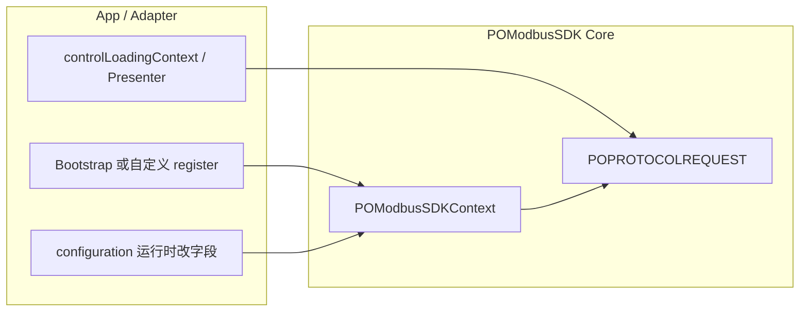

# POModbusSDK 使用与功能扩展指南

> 面向：App 接入、新业务开发、SDK 维护者  
> 架构背景：[POModbusSDK-Architecture.md](./POModbusSDK-Architecture.md)  
> Provider 逐项规范：[Adapter/README.md](./Adapter/README.md)

---

## 1. 模块定位

**POModbusSDK** 是 BLUETTI 设备 **Modbus 2.0 协议栈** 的通信核心，负责：

| 能力 | 典型类 |
|------|--------|
| BLE / MQTT 通道 | `POBLEManager`、`POMQTTManager` |
| 协议解析与队列 | `POModbusProtocol`、`POProtocolRequest` |
| 业务 Request | `ESettingRequest`、`EOTARequest`、`EChargeBoxRequest`… |
| 横切能力抽象 | `POModbusSDKContext` + 四个 Provider |
| 运行时配置 | `POModbusSDKConfiguration`、`POModbusLog` |

**不包含**：设备主页 UI、列表页、空间模块（在 `POFunctionClasses`）；连接后导航半业务在 `POModbusHelper`。

---

## 2. 快速接入（Bluetti 全量）

### 2.1 Pod

```ruby
pod 'POModbus'   # Helper + POFunctionClasses + Full（与历史一致）
```

仅要协议 + 默认桥接：

```ruby
pod 'POModbus/POModbusSDK/Full'
```

仅要 Core（自研 UI / 文案 / 云）：

```ruby
pod 'POModbus/POModbusSDK/Core'
```

### 2.2 启动（必须）

```objc
#import <POModbus/POModbusSDKBootstrap.h>

- (BOOL)application:(UIApplication *)application didFinishLaunchingWithOptions:(NSDictionary *)launchOptions {
    [POModbusSDKBootstrap registerDefaultProviders];
    // … 再 init 网络、进列表等
    return YES;
}
```

**时机**：任意 `POModbusLocalizedString`、MQTT 连接、`POPROTOCOLREQUEST` 控制写 **之前**。  
**注意**：Context 上 Provider 为 `weak`，Bootstrap 内部用 static 强引用持有默认实现。

### 2.3 环境与日志（推荐）

```objc
#import <POModbus/POModbusSDKFacade.h>

- (void)loadLogEnvironment {
    POModbusSDKConfiguration *cfg = POModbusSDKContext.shared.configuration;
    cfg.isProductionEnvironment = POBASECONFIG.isPROEnvironment;

#if DEBUG
    cfg.enableMQTTLog = YES;
    cfg.enableSDKLog = YES;
    // cfg.enableBLELog = YES;  // 扫描调试、AppLog 落盘
#endif
}
```

日志输出：

```objc
POModbusLog(POModbusLogChannelModbus, @"write addr=0x%04X", addr);
POModbusOTALog(@"phase=%ld", (long)phase);  // 非 PRO + Logs DB + enableModbusOTALog
```

通道与 `configuration` 字段对照见 `POModbusSDKLog.h` 注释；**完整链路**（AppLog 落盘、Modbus DB、业务域 Logger）见 [10-POModbus-Logging-System.md](./10-POModbus-Logging-System.md)。

---

## 3. 日常使用

### 3.1 协议单例 `POPROTOCOLREQUEST`

业务侧统一通过宏访问：

```objc
#import <POModbus/POProtocolRequest.h>

#define POPROTOCOLREQUEST [POProtocolRequest instanceSingleton]
```

**读数据**：设置 `queueOptions` 后由队列自动轮询（见 `EquipmentDataHelper` 文档）。

**控制写**（会触发 Loading / 节流，见 §3.3）：

```objc
[POPROTOCOLREQUEST prepareControlLoadingText:@"开机中"];  // 或 Helper 的 POHelperPrepareControlLoading
[POPROTOCOLREQUEST setAlternatorEnable:YES];
```

**OTA**：

```objc
#import <POModbus/EOTARequest.h>
// 经 POPROTOCOLREQUEST 或 EOTARequest 单例，见各 Helper
```

### 3.2 文案

Core / Helper 内 **禁止** 新增 `POLOCALSTRING`。使用 key + Provider：

```objc
#import <POModbus/POModbusSDKFacade.h>

NSString *text = POModbusLocalizedString(POModbusMessageKeyOffline);
```

- SDK 级 key：`POModbusMessageKeys.h`（固件类型、超时、离线等）
- Helper 级 key：`POHelperMessageKeys+*.h`（连接、升级、设备控制等）

**例外**：`POHelperMessageKeys+Status.h` 四条全局状态条文案为 **固定中文字面量**（不经 `messageProvider` / POLocalization），调用处直接使用常量，勿包 `POModbusLocalizedString`。

未注册 `messageProvider` 时，其余 key 降级为 **回显 key** 并打 SDK 日志。

### 3.3 控制下发 Loading

仅 **显式调用** `loadingWhenControlAction` 的控制写会弹 HUD（如 `ESettingRequest` 内）。

| 属性 / API | 作用 |
|------------|------|
| `controlLoadingContext` | 节流间隔、自动消失时长、是否显示 HUD |
| `prepareControlLoadingText:` | 下一次控制写的 HUD 文案 |
| `controlLoadingWillPresent` | 弹出前钩子 |
| `controlLoadingPresenter` | 完全自定义 HUD（可配图） |
| `noLoadingOnce` | 仅下一次：无 HUD、无节流 |

默认参数见 `POControlLoadingState.h`；Helper 业务页使用 `POHelperInstallDefaultControlLoadingContext` + `POHelperPrepareControlLoading`（详见 [09-POModbusHelper-Usage-and-Extension.md](./09-POModbusHelper-Usage-and-Extension.md)）。

完整说明：[Adapter/06-ControlLoading-CustomSpec.md](./Adapter/06-ControlLoading-CustomSpec.md)。

### 3.4 UI 反馈（Toast / Loading）

经 `POModbusUIProviding`（默认 `POModbusToastUIProvider` → POHUB）：

```objc
[POModbusSDKContext.shared.uiProvider showMessage:@"提示"];
[POModbusSDKContext.shared.uiProvider showLoadingWithText:@"加载中" maxDismissDuration:1.5];
```

Helper 层请用 `POModbusHelperUI.h` 门面，不要在新代码里直连 `POHUB`。

### 3.5 MQTT 云能力

`POMQTTManager` 通过 `POModbusCloudProviding` 拉 UTC、下载 TLS 证书。  
换云 API 只改 Adapter 或 App 的 Cloud Provider，**不改** `POMQTTManager`。

### 3.6 资源（plist / 图片）

```objc
NSString *path = [POModbusSDKContext.shared resourcePathForName:@"POModbusBetaProtocol" type:@"plist"];
```

业务图片宏：`POMODBUSIMAGE(@"iconName")`（`POModbusBundle.h`）。

### 3.7 推荐头文件引用

```objc
#import <POModbus/POModbusSDKFacade.h>      // Context、Provider、Log、MessageKeys
#import <POModbus/POModbusSDKBootstrap.h>  // 仅 Full / 全量 Pod
#import <POModbus/POProtocolRequest.h>     // 协议单例
#import <POModbus/POBLEManager.h>
#import <POModbus/POModbusBundle.h>
```

修改 podspec `public_header_files` 后须 `pod install` + Clean Build。

---

## 4. 功能扩展

### 4.1 扩展方式总览



| 扩展目标 | 方式 | 文档 |
|----------|------|------|
| 文案 / 多语言 | 实现 `POModbusMessageProviding` | [01-MessageProviding](./Adapter/01-MessageProviding-CustomSpec.md) |
| Toast / Loading / 离线 | 实现 `POModbusUIProviding` | [02-UIProviding](./Adapter/02-UIProviding-CustomSpec.md) |
| MQTT UTC / 证书 | 实现 `POModbusCloudProviding` | [03-CloudProviding](./Adapter/03-CloudProviding-CustomSpec.md) |
| plist / Bundle | 实现 `POModbusResourceProviding` | [04-ResourceProviding](./Adapter/04-ResourceProviding-CustomSpec.md) |
| 日志 / PRO 环境 | 改 `POModbusSDKConfiguration` | [05-Configuration](./Adapter/05-Configuration-CustomSpec.md) |
| 控制 HUD | `controlLoadingContext` / `controlLoadingPresenter` | [06-ControlLoading](./Adapter/06-ControlLoading-CustomSpec.md) |
| 新协议 API | 在 `POModbusProtocol` 加 Request 方法 | 本节 §4.4 |

### 4.2 仅引 Core：完整自定义 register

```objc
#import <POModbus/POModbusSDKFacade.h>

static MyMessageProvider *sMsg;
static MyUIProvider *sUI;
static MyCloudProvider *sCloud;
static MyResourceProvider *sRes;

+ (void)setupModbusSDK {
    sMsg = [MyMessageProvider new];
    sUI = [MyUIProvider new];
    sCloud = [MyCloudProvider new];
    sRes = [MyResourceProvider new];

    [[POModbusSDKContext shared] registerMessageProvider:sMsg
                                             uiProvider:sUI
                                          cloudProvider:sCloud
                                       resourceProvider:sRes
                                          configuration:nil];
}
```

**硬性规范**：

1. Provider 必须 **static / 属性强引用**（Context 为 weak）
2. **主线程** register
3. 在首次 Modbus / MQTT 连接前完成
4. `configuration:nil` 保留默认；传实例则 **整体替换**

### 4.3 部分替换（混用默认 + 自定义）

```objc
[POModbusSDKBootstrap registerDefaultProviders];

static MyCloudProvider *sCloud;
sCloud = [MyCloudProvider new];
[[POModbusSDKContext shared] registerMessageProvider:nil
                                         uiProvider:nil
                                      cloudProvider:sCloud
                                   resourceProvider:nil
                                          configuration:nil];
```

`nil` 项跳过，非 nil 覆盖已有 Provider。

### 4.4 新增协议能力（Request 层）

1. 在 `POModbusProtocol` 对应 `*Request.h/.m` 增加方法  
2. 控制写若需 HUD：方法内调用 `[self loadingWhenControlAction]`（或业务侧 `Prepare` + 调用）  
3. 静默写：调用方设 `noLoadingOnce = YES` 或 `showsHUD = NO`  
4. 新错误文案：在 `POModbusMessageKeys.h` 增加常量，Core 内 `POModbusLocalizedString`  
5. 更新 podspec `public_header_files`（若新增公共头）

### 4.5 新增日志通道（可选）

1. `POModbusLogChannel` 枚举 + `POModbusSDKConfiguration` 属性  
2. `POModbusLogEnabled:` / `POModbusLogChannelTag:` 补分支  
3. `configurationMatchingLegacyLogMacros` 设默认值  
4. 业务代码 `POModbusLog(新channel, …)`

### 4.6 自定义控制 Loading HUD

```objc
#import <POModbus/POControlLoadingState.h>

// 纯状态（Core）
POPROTOCOLREQUEST.controlLoadingContext = [POControlLoadingState defaultState];
POPROTOCOLREQUEST.controlLoadingContext.dismissDuration = 2.0;
POPROTOCOLREQUEST.controlLoadingContext.debounceInterval = 0.3;

// 完全自定义呈现
POPROTOCOLREQUEST.controlLoadingPresenter = ^(POControlLoadingState *ctx) {
    // 自绘 HUD；ctx.loadingText、ctx.showsHUD
};
```

配图 Loading 使用 Helper 的 `POControlLoadingContext`（多 `iconImage`），见 Helper 扩展文档。

### 4.7 单元测试 / 无 UI 工具

```ruby
pod 'POModbus/POModbusSDK/Core'
```

注入 Mock Provider：文案回显 key、Loading 只打 log、Cloud 返回固定 UTC。无需 POLocalization / POToast。

---

## 5. 常见场景

| 场景 | 做法 |
|------|------|
| Bluetti 现有 App | `pod 'POModbus'` + `registerDefaultProviders` + `loadLogEnvironment` |
| 桌面 Modbus 调试工具 | Core + Mock UI/Cloud Provider |
| 换 Toast 库 | 实现 `POModbusUIProviding`，register 覆盖默认 |
| Debug 开 BLE 日志 | `configuration.enableBLELog = YES`（配合 App `debugLogSinkBlock` 落盘） |
| 正式包禁 OTA 调试日志 | `isProductionEnvironment = YES` |
| 控制写不要弹窗但要节流 | `showsHUD = NO` |
| 单次静默写 | `noLoadingOnce = YES` |

---

## 6. 与 POModbusHelper 的边界

| 层次 | 职责 |
|------|------|
| **POModbusSDK** | 协议、通道、Provider、Configuration、控制 Loading **机制** |
| **POModbusHelper** | 连接流程、会话数据、OTA 封装、Toast 门面、路由协议、Debug 页 |

**PCH 边界**：`POModbusSDK/Core` **无** 预编译头，不 import `POModbusCommonImports`；预编译仅用于 Helper / POFunctionClasses（见 [09 §2.4](./09-POModbusHelper-Usage-and-Extension.md#24-预编译头与-pomodbuscommonimports)）。

Helper 依赖 Full；业务 VC 依赖 Helper + POFunctionClasses。  
Helper 使用说明见 [09-POModbusHelper-Usage-and-Extension.md](./09-POModbusHelper-Usage-and-Extension.md)。

---

## 7. 相关文档

| 文档 | 内容 |
|------|------|
| [POModbusSDK-Architecture.md](./POModbusSDK-Architecture.md) | 分层、痛点、演进 |
| [Adapter/README.md](./Adapter/README.md) | Provider 自定义索引 |
| [07-POModbusHelper-Refactoring.md](./07-POModbusHelper-Refactoring.md) | Helper 改造、测试清单、Debug §10 |
| [09-POModbusHelper-Usage-and-Extension.md](./09-POModbusHelper-Usage-and-Extension.md) | Helper 使用与扩展 |
| [10-POModbus-Logging-System.md](./10-POModbus-Logging-System.md) | 日志体系总览（POLog / POModbusLog / DB / 业务 Logger） |
