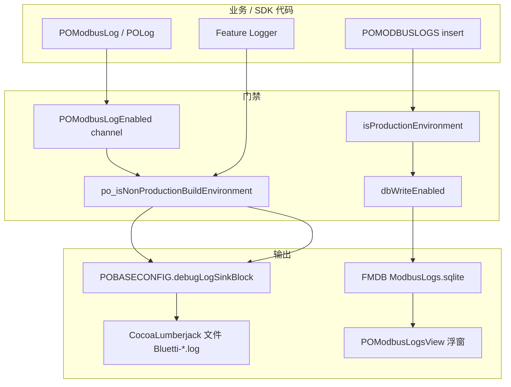

# POModbus 日志体系说明

> 面向：联调、问题定位、SDK / Helper 维护者  
> 相关：[08 SDK 使用](./08-POModbusSDK-Usage-and-Extension.md) §2.3、[09 Helper 使用](./09-POModbusHelper-Usage-and-Extension.md) §4.7、[Adapter/05-Configuration](./Adapter/05-Configuration-CustomSpec.md)、[07 §9.13 P2-4](./07-POModbusHelper-Refactoring.md#913-p2-4-日志与配置收敛helper)

---

## 1. 总览

POModbus 日志分 **四条通路**，不要混用概念：

| 通路 | 作用 | 典型入口 |
|------|------|----------|
| **A. 控制台 `POLog`** | 非 PRO 环境调试打印；可经 App 落盘 | `POLog(...)`、`POModbusLog(...)` |
| **B. SDK 通道 `POModbusLog`** | 按 channel 运行时开关，带 `[Tag]` 前缀 | `POModbusSDKLog.h` |
| **C. Modbus Logs DB** | 协议读写/OTA 结构化落库，浮窗展示与导出 | `POMODBUSLOGS insertLogsWithType:` |
| **D. 业务域专用 Logger** | 单功能全流程 trace（前缀固定，便于控制台过滤） | `POWiFiConfigLogger`、`EACInputSourceLog` 等 |



**源码真源**（勿改仓库根 `Core/` 镜像）：

- `POModbus/Classes/POModbusSDK/Core/POAbstraction/Configuration/POModbusSDKLog.h`
- `POModbus/Classes/POModbusSDK/Core/POAbstraction/Configuration/POModbusSDKConfiguration.m`
- `pobase/POBase/Classes/BaseConfig/POGlobalConfig.h`（`POLog` 宏）
- `bluetti/Bluetti/AppDelegate/BluettiDebugLog.m`（App 落盘）

---

## 2. 底层：`POLog`（POBase）

所有「控制台行」最终可落到 `POLog`：

```objc
// POGlobalConfig.h
#define POLog(format, ...)  // 仅非 PRO 构建环境；格式化后走 debugLogSinkBlock
```

| 条件 | 行为 |
|------|------|
| `POBASECONFIG.isPROEnvironment`（正式包） | **不输出** |
| Debug / UAT | 输出；若设置了 `debugLogSinkBlock` 则交给 App |
| 无 sink | 仅宏内组装字符串，**默认不进 Xcode 控制台**（除非 sink 里打 DDLog） |

`POLog` 行格式包含：时间、`文件名:行号`、`__PRETTY_FUNCTION__`、消息正文。

### Bluetti：`BluettiDebugLogInstall`

`AppDelegate+Config` → `loadLogEnvironment` → `BluettiDebugLogInstall()`（DEBUG/UAT + CocoaLumberjack）：

1. `POBASECONFIG.debugLogSinkBlock` → `DDLogInfo` → 文件 `Bluetti-<环境>-<日期>-<序号>.log`
2. 每 **100 条**自动 flush；分享前强制 flush
3. `debugLogShareBlock` → Modbus 浮窗 **AppLog** 按钮分享最新 log 文件

因此：**打开 `enableBLELog` 后，BLE 扫描日志会经 `POModbusLog` → `POLog` → AppLog 落盘**（非 PRO）。

---

## 3. SDK 统一入口：`POModbusLog`（P2-4）

### 3.1 API

```objc
#import <POModbus/POModbusSDKLog.h>

POModbusLog(POModbusLogChannelModbus, @"ProtocolVersion start …");

if (POModbusLogEnabled(POModbusLogChannelBLE)) {
    POModbusLog(POModbusLogChannelBLE, @"…");
}

POModbusOTALog(@"phase=%ld", (long)phase);  // OTA 专用，见 §3.3
```

实现：`channel` 开关为 ON 时调用 `POLog(@"[Tag] " format, …)`。

`POLogEnableConfig.h` 已废弃，仅 `#import "POModbusSDKLog.h"` 转发。

### 3.2 通道与默认开关

默认值**唯一维护**：`+[POModbusSDKConfiguration configurationMatchingLegacyLogMacros]`

| Channel | configuration 属性 | 默认 | 主要代码位置 |
|---------|-------------------|------|----------------|
| `POModbusLogChannelBLE` | `enableBLELog` | **NO** | `POBLEManager`、`EquipmentConnectHelper`、`BLEEquipmentSearchHelper` |
| `POModbusLogChannelMQTT` | `enableMQTTLog` | NO | `POMQTTManager` |
| `POModbusLogChannelProtocol` | `enableProtocolLog` | YES | `EBaseProtocol` |
| `POModbusLogChannelModbus` | `enableModbusLog` | YES | `POProtocolRequest`、`POModbusProtocol` |
| `POModbusLogChannelModbusOTA` | `enableModbusOTALog` | YES | `EOTARequest`（与 `POModbusOTALog` 叠加三门禁） |
| `POModbusLogChannelModbusData` | `enableModbusDataLog` | YES | `EquipmentDataHelper` 队列 JSON |
| `POModbusLogChannelPushData` | `enablePushDataLog` | NO | 列表 MQTT Push |
| `POModbusLogChannelPath` | `enablePathLog` | YES | `POPathProtocol` |
| `POModbusLogChannelPathData` | `enablePathDataLog` | YES | Path 解析数据 |
| `POModbusLogChannelSDK` | `enableSDKLog` | YES | Context / Provider / `EquipmentSpeechView` |

**非 channel 配置**（见 `POModbusSDKConfiguration.h`）：

| 属性 | 默认 | 说明 |
|------|------|------|
| `enableWiFiConfigLog` | YES | `POWiFiConfigLogger`，前缀 `[WiFiConfig]` |
| `isProductionEnvironment` | NO（App 启动同步 `isPROEnvironment`） | PRO 时不写 Modbus DB、WiFi 配网日志关闭、OTA 调试受限 |

### 3.3 OTA 特殊三门禁：`POModbusOTALog`

```objc
#define PO_OTA_ShouldLog() \
    (!configuration.isProductionEnvironment && \
     [POModbusLogsDBManager isModbusLogDBEnabled] && \
     configuration.enableModbusOTALog)

#define POModbusOTALog(format, ...) \
    do { if (PO_OTA_ShouldLog()) { POModbusLog(POModbusLogChannelModbusOTA, format, ##__VA_ARGS__); } } while (0)
```

须同时满足：**非 PRO** + **Modbus Logs DB 开关开** + **`enableModbusOTALog`**。  
Helper `*OTAHelper.m` 与 Core `EOTARequest.m` 统一走此宏。

### 3.4 App 侧开关（Bluetti 示例）

```objc
// AppDelegate+Config.m — loadLogEnvironment
POBASECONFIG.buildEnvironment = …;
POModbusSDKContext.shared.configuration.isProductionEnvironment = POBASECONFIG.isPROEnvironment;
[POModbusSDKBootstrap registerDefaultProviders];

#if DEBUG
// POModbusSDKContext.shared.configuration.enableMQTTLog = YES;
// POModbusSDKContext.shared.configuration.enableBLELog = YES;
#endif
```

运行时改 `POModbusSDKContext.shared.configuration` 即可，**无需**二次 register。

---

## 4. Modbus Logs DB + 调试浮窗

### 4.1 `POModbusLogsDBManager`

- 单例：`POMODBUSLOGS`
- SQLite 存协议轨迹；`type` 含义见 `POModbusLogsDBManager.h`（0 写 / 1 写回 / 2~5 读与错误 / 11~13 OTA / 99 状态备注）
- 写入门禁：
  1. `isProductionEnvironment == NO`
  2. `dbWriteEnabled == YES`（浮窗 DB 开关，默认 YES）

写入点：`POBLEManager`（BLE 收发/鉴权）、`POProtocolRequest`、`EOTARequest`、`POPathProtocol` 等。

### 4.2 `POModbusLogsView`（Helper Interface/Logs）

| 能力 | 说明 |
|------|------|
| 入口 | 连续点击屏幕角落（非 PRO）；`+loadModbusLogsWithController:` |
| DB 开关 | 控制是否 `insertLogsWithType`（不影响控制台 `POModbusLog`） |
| 导出 | 导出 Modbus DB 数据 |
| **AppLog** | 调 `POBASECONFIG.debugLogShareBlock`，分享 Bluetti 应用日志 |
| 清空 | 删除 DB 全部记录 |

PRO 包：`loadModbusLogsWithController` 直接 return，浮窗不可用。

---

## 5. Helper 层（P2-4 收敛）

### 5.1 规范

| 场景 | 用法 |
|------|------|
| 新 Helper 调试日志 | `POModbusLog(POModbusLogChannelXxx, …)` |
| OTA Helper | `POModbusOTALog` |
| **禁止** 新增散落 `POLog`（历史少量 `[BLEConnect]` 待收拢） |

### 5.2 已迁移文件（摘要）

| 模块 | Channel / API |
|------|----------------|
| `EquipmentConnectHelper` | `BLE`（session、成功/失败/重复导航） |
| `BLEEquipmentSearchHelper` | `BLE`（scan quick/timed/blocked） |
| `EquipmentDataHelper` | `ModbusData`（队列 JSON）；部分 `BLE`；残留 4 处 `POLog [BLEConnect]` |
| `Upgrade/*OTAHelper` | `POModbusOTALog` |
| `EquipmentSpeechView` | `SDK` |
| `POBLEManager`（SDK） | `BLE` 控制台 + `POMODBUSLOGS` DB |

### 5.3 Debug 页验日志

`EquipmentSettingViewController`（DEBUG）→ **Helper UI** → **P2-4 · POModbusLog**：

- 各 channel 样例输出
- 切换 `enableBLELog`
- `POModbusOTALog` 样例

---

## 6. POFunctionClasses 业务域专用 Logger

不走 `POModbusLogChannel` 枚举，**直接用 `POLog` + 固定前缀**，便于 Xcode 控制台过滤。

### 6.1 `POWiFiConfigLogger`（配网）

| 项 | 说明 |
|----|------|
| 前缀 | `[WiFiConfig][sid=xxxx][LEVEL][category]` |
| 开关 | `enableWiFiConfigLog` && 非 PRO |
| 会话 | `beginFlowWithEntry:` / `endFlowWithPage:`，同 sid 过滤单次配网 |
| 过滤 | 控制台搜 `[WiFiConfig]`、`[ERROR]`、`sid=` |

### 6.2 `EACInputSourceLog`（交流输入源）

| 宏 | 页面 |
|----|------|
| `EACInputSettingLog` | 设置页 `[设置]` |
| `EACInputWiringLog` | 接线页 `[接线]` |
| `EACInputCheckLog` | 自检页 `[自检]` |
| 统一前缀 | `【AC输入源】` |

辅助函数：`EACInputSettingLogPollUpdate`、`EACInputCheckLogPollUpdate`（轮询字段 diff）。

### 6.3 `POPlugPointSocLimitLog`（智能插座主页）

| 项 | 说明 |
|----|------|
| 宏 | `POSocketMainDiagLog` → `[Diag][SocketMain]` |
| 编译开关 | `POEnableSocketMainDiagLog`：DEBUG=1，Release=0 |
| 场景函数 | `POSocketMainDiagLogThresholdCache`、`…RealtimeUI`、`…ModbusContext` 等 |

用于 14500/14700 轮询、电量阈值、AC 开关联调；**不**受 `POModbusSDKConfiguration` channel 控制。

---

## 7. SDK Core 残留 `POLog`（待续迁）

以下仍直接 `POLog`（无 channel 开关），联调时只要非 PRO 就会打：

| 文件 | 内容 |
|------|------|
| `POProtocolRequest.m` | 队列超时、CRC/前缀错误、读失败 |
| `POMQTTManager.m` | MQTT 超时/发送错误 |
| `EQueueRequest.m` | 队列相关 |
| `POModbusLogsDBManager.m` | 插入 DB 失败 |
| `EOTARequest.m` | 少量 OTA 路径 |

新代码应优先 `POModbusLog`；存量可按模块逐步替换。

---

## 8. 控制台过滤速查

| 搜什么 | 看什么 |
|--------|--------|
| `[BLE]` | 蓝牙连接/扫描/MTU/鉴权（需 `enableBLELog`） |
| `[Modbus]` | 协议版本、队列、MQTT/BLE notification |
| `[ModbusData]` | EquipmentDataHelper 队列 JSON |
| `[ModbusOTA]` | OTA 阶段（+ 三门禁） |
| `[WiFiConfig]` | 配网全流程 |
| `【AC输入源】` | 交流输入源三页 |
| `[Diag][SocketMain]` | 插座主页诊断（仅 DEBUG 编译） |
| `[BLEConnect]` | 会话结束/重连（当前多为裸 `POLog`） |

---

## 9. 新增日志怎么写

### 9.1 SDK / Helper 通用调试

1. 选 channel（或新增 channel：枚举 + configuration + `POModbusLogEnabled` + 默认值）
2. `POModbusLog(POModbusLogChannelXxx, @"…", …)`
3. 需要落 Modbus 浮窗时：`[POMODBUSLOGS insertLogsWithType:…]`（注意 PRO / dbWriteEnabled）

### 9.2 单功能长线 trace（业务页）

参考 `POWiFiConfigLogger`：

- 独立类或头文件宏 + 统一前缀
- 自有开关（`configuration` 属性或 DEBUG 编译宏）
- 文档注释写清控制台过滤串

### 9.3 不要

- 在 Helper 新加裸 `POLog`（除非与 `[BLEConnect]` 同类待批量收拢）
- 在 PRO 包依赖 Modbus 浮窗或 OTA 控制台日志做业务逻辑
- 修改仓库根 `Core/` 镜像而非 `POModbus/Classes/POModbusSDK/Core/`

---

## 10. 联调检查清单

| 步骤 | 操作 |
|------|------|
| 1 | 非 PRO 包；`registerDefaultProviders` |
| 2 | `BluettiDebugLogInstall` 已调用（要 AppLog 落盘） |
| 3 | 按需 `enableBLELog` / `enableMQTTLog` |
| 4 | Modbus 浮窗：DB 开关 ON（OTA 日志还要 DB 开 + `enableModbusOTALog`） |
| 5 | 设置页 DEBUG → Helper UI → P2-4 验证 channel |
| 6 | 分享：浮窗 **AppLog**（应用 log）或 **导出**（Modbus DB） |

---

## 11. 相关文档

| 文档 | 内容 |
|------|------|
| [08-POModbusSDK-Usage-and-Extension.md](./08-POModbusSDK-Usage-and-Extension.md) | SDK 接入、§2.3 日志 |
| [09-POModbusHelper-Usage-and-Extension.md](./09-POModbusHelper-Usage-and-Extension.md) | Helper §4.7、Debug 入口 |
| [07-POModbusHelper-Refactoring.md](./07-POModbusHelper-Refactoring.md) | P2-4 改造记录 §9.13 |
| [Adapter/05-Configuration-CustomSpec.md](./Adapter/05-Configuration-CustomSpec.md) | configuration 字段 |

*维护时请与 `POModbusSDKLog.h`、`POModbusSDKConfiguration.m`、`POGlobalConfig.h`（POLog）、`BluettiDebugLog.m` 保持一致。*
