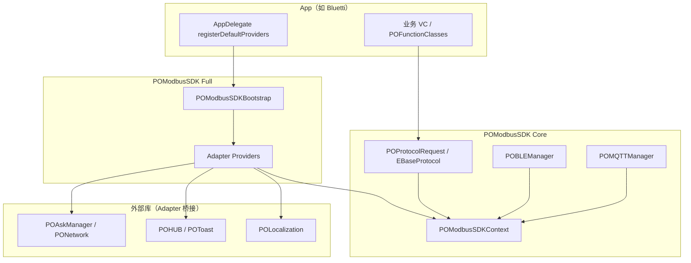

# POModbus SDK 架构与设计说明

> 面向维护者、新业务接入方与后续独立 Pod 拆分。  
> **使用与扩展**：[08-POModbusSDK-Usage-and-Extension.md](./08-POModbusSDK-Usage-and-Extension.md) · [09-POModbusHelper-Usage-and-Extension.md](./09-POModbusHelper-Usage-and-Extension.md)  
> 控制下发 Loading 的 API 细节见头文件 `POControlLoadingState.h`。

---

## 1. 背景与痛点

POModbus 最初从 POBase 抽离，承担 BLUETTI 全系设备的 **Modbus 2.0 协议栈**（BLE / MQTT / 队列读写 / OTA / Path 协议等）。随着业务膨胀，仓库内同时存在三类代码：

| 层次 | 典型内容 | 问题 |
|------|----------|------|
| **通信核心** | `POBLEManager`、`POMQTTManager`、`POParser`、`POProtocolRequest` | 本应可独立复用 |
| **应用工具** | 设备搜索、OTA Helper、调试 Logs、动画组件 | 与核心混在同一依赖树 |
| **业务 UI** | 设备主页、设置页、空间、AECC 等 `POFunctionClasses` | 体量最大，却与 SDK 同 Pod |

迁移前的主要痛点：

1. **依赖耦合**：Core 内直接 `#import POLocalization`、`POToast`/`POHUB`、`POAskManager`（MQTT 证书）、`POModbusBundle`，导致「只要协议能力」也必须拉整包 UI / 本地化 / 网络栈。
2. **编译期日志开关**：`POLogEnableConfig.h` 用 0/1 宏控制各通道日志，改开关需重编，Debug 与 Release 行为不一致。
3. **根 Pod 过重**：Swift、AECC.framework、全量 `resource_bundles`、Masonry 等挂在根上，任意 subspec 都会间接带上。
4. **难以独立演进**：无法把「纯 Modbus SDK」单独给其它 App、桌面工具或后续 Swift Package 使用；业务层也无法在不改 Core 的前提下换 Toast / 云 API 实现。
5. **控制体验分散**：控制写指令的队列节流与 Loading 逻辑写在 `EBaseProtocol` 里，但 HUD 强依赖 POHUB，业务难以「自有 Loading」或「只要节流不要弹窗」。
6. **对外头文件链断裂**：subspec 拆分后若 `public_header_files` 过窄（如 Protocol 只公开 `POControlLoadingState.h`），App 引用 `EquipmentDataHelper.h` 时会连带报 `POProtocolRequest.h` not found。

---

## 2. 设计目标

在 **不破坏 Bluetti 现有 `pod 'POModbus'` 用法** 的前提下：

- 把 **通信核心（Core）** 与 **POLocalization / POToast / 云 API / 业务 Bundle** 解耦；
- 用 **协议 + 注入（Provider）** 替代 Core 内的具体实现类；
- 用 **CocoaPods subspec** 表达物理分层，为将来拆成独立 Pod 做准备；
- 把 **运行时配置**（日志、环境）收敛到 `POModbusSDKConfiguration`，替代散读 `POGlobalConfig` 与编译期宏；
- 把 **控制 Loading** 参数化，业务通过 `POPROTOCOLREQUEST` 属性定制，Core 不 import UIKit；
- 明确 **public_header_files** 与 App import 规范，避免分层后 umbrella 缺依赖头。

---

## 3. 分层结构

```text
POModbus（根 Pod）
├── 根级：Swift、AECC.framework、POModbusBundle 资源（语言包/图片/协议 CSV 等）
│
├── POModbusSDK                    ← 通信与协议
│   ├── POAbstraction              ← 门面：Context、Provider 协议、Configuration、MessageKeys
│   ├── POChannelTools             ← BLE / MQTT / Logs DB
│   ├── POModel / POParser         ← 数据模型与解析
│   ├── POModbusProtocol           ← Request 层（EBaseProtocol、ESettingRequest…）
│   ├── POPathProtocol             ← Path 协议
│   ├── Core                       ← 上述模块聚合 + POModbusSDKCore.bundle
│   ├── Adapter                    ← 默认 Provider 实现 + Bootstrap（依赖 POLocalization/POBase）
│   └── Full                       ← Core + Adapter（Helper / 业务应依赖此层）
│
├── POModbusHelper                 ← 半业务工具（搜索、OTA、动画、POControlLoadingContext）
└── POFunctionClasses              ← 完整业务 UI（设备主页/设置/空间…）
```

### 3.1 依赖关系（推荐）



| Subspec | 适用场景 | 主要依赖 |
|---------|----------|----------|
| `POModbus/POModbusSDK/Core` | 只要 Modbus 协议，自研 UI/文案/云 | POBase、POCategory、MJExtension、MQTTClient、FMDB |
| `POModbus/POModbusSDK/Adapter` | 提供 Bluetti 系默认桥接 | Core + POLocalization + PONetwork + POBase |
| `POModbus/POModbusSDK/Full` | Bluetti / Helper / 业务默认选择 | Core + Adapter |
| `POModbus/POModbusHelper` | 搜索、OTA、通用 UI 组件 | Full + Masonry 等 |
| `POModbus/POFunctionClasses` | 完整设备业务模块 | Full + Helper |
| `POModbus`（根） | 与历史一致，Bluetti `pod 'POModbus'` | 上述全部 + 根资源 |

---

## 4. 核心机制：Provider + Context

### 4.1 原则

**SDK Core 只认协议，不认 POLocalization / POToast / POAskManager。**

所有横切能力通过 `POModbusSDKContext` 单例注入：

| Provider 协议 | 职责 | Core 侧入口 |
|---------------|------|-------------|
| `POModbusMessageProviding` | key → 本地化字符串 | `POModbusLocalizedString(key)` |
| `POModbusUIProviding` | Toast、离线提示、控制 Loading | `POModbusSDKContext+UI` |
| `POModbusCloudProviding` | MQTT UTC、TLS 证书下载 | `POModbusSDKContext+Cloud` |
| `POModbusResourceProviding` | plist / 图片路径 | `POModbusSDKContext+Resource` |

文案 key 常量化在 `POModbusMessageKeys.h`，与 POLocalization 资源表保持一致。

### 4.2 注册方式

**Full / Bluetti 路径（推荐，一行搞定）：**

```objc
#import <POModbus/POModbusSDKBootstrap.h>

// application:didFinishLaunchingWithOptions: 中，Modbus 连接之前
[POModbusSDKBootstrap registerDefaultProviders];
```

Bootstrap 内部 `dispatch_once` 创建并 **static 强引用** 四个默认实现，再调用：

```objc
[[POModbusSDKContext shared] registerMessageProvider:...
                                         uiProvider:...
                                      cloudProvider:...
                                   resourceProvider:...
                                      configuration:nil];
```

> **注意**：Context 上 Provider 为 `weak`。Bootstrap 或 App 必须用 static / 强引用持有实现对象，否则注册后会被释放。

**仅 Core 路径（自研 App / 工具）：**

自行实现四个协议（或只实现必需方法），在启动时 register。未注册时 Core 会 **降级**：文案回传 key 本身并 `POModbusLog(POModbusLogChannelSDK, ...)`；Loading 只打日志不弹 HUD。

### 4.3 Adapter 默认实现

| 类 | 桥接目标 |
|----|----------|
| `POModbusDefaultMessageProvider` | `POLocalization` |
| `POModbusToastUIProvider` | `POHUB` / POToast |
| `POModbusMQTTCloudProvider` | 原 `POAskManager` HTTP + 证书逻辑 |
| `POModbusResourceBundleProvider` | `POModbusBundle` + 回退 `POModbusSDKCore.bundle` |

---

## 5. 这样设计有什么用

### 5.1 对 Core 维护者

- 新增协议错误提示：在 `POModbusMessageKeys` 加常量，Core 内 `POModbusLocalizedString`，**不必** import POLocalization。
- MQTT 换云 API：只改 Adapter 或 App 的 `POModbusCloudProviding` 实现，`POMQTTManager` 不动。
- 单元测试 / 桌面工具：引 `Core`，注入 Mock Provider，无需 UI 库。

### 5.2 对业务 App

- 启动一行 `registerDefaultProviders`，行为与迁移前一致。
- 控制 Loading、Toast、全局文案可通过 `POPROTOCOLREQUEST` / `controlLoadingContext` 定制（见 `POControlLoadingState.h`）。
- Debug 下可在 `loadBaseConfig` 改 `POModbusSDKContext.shared.configuration` 的日志开关，**无需改宏重编**。

### 5.3 对仓库演进

- subspec 边界清晰，后续可把 `Core` 抽成独立 Pod `POModbusSDK`，`Adapter` 留 Bluetti Kit，业务 `POFunctionClasses` 留本仓或 App 仓。
- `POModbusSDKConfiguration` 预留 `protocolRequestTimeout`、`bleWriteTimeout`，逐步替代 Core 内散读 `POGlobalConfig`。

---

## 6. 外部接入指南

> **Adapter 逐项自定义**（协议 API、DTO、降级、验收）：见 [Adapter/README.md](./Adapter/README.md)。

### 6.1 Bluetti 全功能（现状）

```ruby
# Podfile
pod 'POModbus'   # 等价于 Helper + POFunctionClasses + Full
```

```objc
// AppDelegate.m — 必须早于任何 Modbus / MQTT 连接
[POModbusSDKBootstrap registerDefaultProviders];

// 可选：Debug 日志（AppDelegate+Config / loadBaseConfig）
POModbusSDKConfiguration *cfg = POModbusSDKContext.shared.configuration;
cfg.enableSDKLog = YES;
cfg.enableMQTTLog = YES;
cfg.isProductionEnvironment = POBASECONFIG.isPROEnvironment;
```

业务控制设备仍通过 **`POPROTOCOLREQUEST`**（`[POProtocolRequest instanceSingleton]`）：

```objc
[POPROTOCOLREQUEST prepareControlLoadingText:@"开机中"];
[POPROTOCOLREQUEST setAlternatorEnable:YES];
```

### 6.2 只要 SDK + 自研 UI

```ruby
pod 'POModbus/POModbusSDK/Core'
```

```objc
#import <POModbus/POModbusSDKFacade.h>

static MyMessageProvider *sMsg;
static MyUIProvider *sUI;

+ (void)setupModbusSDK {
    sMsg = [MyMessageProvider new];
    sUI = [MyUIProvider new];
    [[POModbusSDKContext shared] registerMessageProvider:sMsg
                                             uiProvider:sUI
                                          cloudProvider:[MyCloudProvider new]
                                       resourceProvider:[MyResourceProvider new]
                                          configuration:nil];
}
```

实现要点：

- `POModbusMessageProviding`：`messageForKey:` 返回 App 本地化字符串。
- `POModbusUIProviding`：至少实现 `showMessage:`；控制 Loading 建议实现 `showLoadingWithText:maxDismissDuration:` 等 optional 方法。
- `POModbusCloudProviding`：若用 MQTT，必须实现 `fetchMQTTUTCInfoWithCompletion:` 与 `prepareMQTTTLSMaterialsWithUTCInfo:...`。
- `POModbusResourceProviding`：`pathForResourceName:fileType:`；未命中时可依赖 Core 自带 `POModbusSDKCore.bundle`（含 `POModbusBetaProtocol.plist`）。

### 6.3 Helper 层扩展（配图 Loading 等）

`POControlLoadingState`（Core，纯状态）与 `POControlLoadingContext`（Helper 子类，多 `iconImage`）区别见 `POControlLoadingContext.h` / `POControlLoadingState.h`。默认 HUD 不消费 `iconImage`，配图需 `controlLoadingPresenter`。

```ruby
pod 'POModbus/POModbusHelper/Helper'
```

```objc
#import <POModbus/POControlLoadingContext.h>

POPROTOCOLREQUEST.controlLoadingContext = [POControlLoadingContext defaultContext];
POPROTOCOLREQUEST.controlLoadingPresenter = ^(POControlLoadingState *ctx) {
    POControlLoadingContext *uiCtx = [ctx isKindOfClass:[POControlLoadingContext class]] ? (POControlLoadingContext *)ctx : nil;
    // 使用 uiCtx.iconImage 自定义 HUD
};
```

### 6.4 头文件引用与 public_header（App 工程必读）

Bluetti 使用 `use_frameworks!`，POModbus 以 **静态 Framework** 集成。外部工程能 `#import` 到的头文件，必须在 podspec 里声明为 **`public_header_files`**，并打进 `POModbus-umbrella.h`。

| Subspec | public_header 策略 | 典型对外头文件 |
|---------|-------------------|----------------|
| `POAbstraction` | `**/*.h` | `POModbusSDKContext.h`、`POModbusSDKFacade.h` |
| `POModbusProtocol` | `**/*.h` | `POProtocolRequest.h`、`EBaseProtocol.h`、`POControlLoadingState.h` |
| `Adapter` | 白名单 4 个 + `POModbusBundle.h` | `POModbusSDKBootstrap.h` |
| `POModbusHelper/Helper` | `**/*.h` | `EquipmentDataHelper.h`、`EquipmentConnectHelper.h` |
| `POModbusHelper/Models` | 未限制（默认全公开） | `EquipmentItemModel.h`、`EquipmentDataModel.h` |
| `POChannelTools` / `POParser` 等 | 未限制（默认全公开） | `POBLEManager.h`、`POModbusProtocol.h` |
| `POFunctionClasses` | 未限制（默认全公开） | 各业务 VC / Model 头文件 |

**App 侧推荐写法：**

```objc
#import <POModbus/EquipmentDataHelper.h>
#import <POModbus/EquipmentConnectHelper.h>
#import <POModbus/POModbusBundle.h>   // POMODBUSIMAGE / POMODBUSBUNDLE
```

引号写法 `#import "EquipmentConnectHelper.h"` 在 Framework 的 `Headers` 进搜索路径时也可用，但 **更推荐尖括号 + 模块名**，与 CocoaPods 生成方式一致。

**公共头文件的传递依赖：**  
`EquipmentDataHelper.h` 内部 `#import "POProtocolRequest.h"` 等，要求这些依赖头 **同样出现在 umbrella 中**。分层时若把 `POModbusProtocol` 的 public 缩成单个 `POControlLoadingState.h`，会导致 App 编译 `'POProtocolRequest.h' file not found`——需恢复 `POModbusProtocol/**/*.h` 或补齐依赖链。

**修改 podspec 后：** App 工程执行 `pod install`，Xcode **Clean Build Folder** 再编。

### 6.5 POFunctionClasses 预编译头

`POFunctionClasses` 使用 `POModbusFunctionClasses-Prefix.pch`，对齐 Bluetti `POPrefixHeader`，统一注入：

- `POBaseConfig` / `POGlobalConfig` / `POLocalizationBundle`
- **`POModbusBundle.h`**（`POMODBUSIMAGE` 等宏，SDK 解耦后不再间接注入）
- `POToast` / `POAlert` / `Masonry` / `MJExtension`

因此 **POFunctionClasses 下的 `.m` 无需再单独 `#import <POModbus/POModbusBundle.h>`**；`.h` 不受 PCH 保护，若头文件内用宏仍需自行 import。

### 6.6 POModbusHelper 预编译头

`POModbusHelper` 使用 `POModbusHelper-Prefix.pch`，解决 SDK 解耦后 Helper 层 `.m` 缺 `POHUB` / `POMODBUSIMAGE` 等问题；**P2-2 起**不再注入 `POLocalizationBundle`，文案改经 `POModbusSDKFacade` + `POModbusHelperUI`（`POHelperLocalizedString`）。

| 项 | 说明 |
|----|------|
| podspec | `POModbusHelper` 父 subspec 设置 `prefix_header_file` |
| 覆盖范围 | Helper / Models / Search / Upgrade / Interface 下全部 `.m` |
| 与 FunctionClasses 区别 | 无额外业务 VC import；导航解耦见 P1 路由改造 |
| pod 依赖补齐 | `POCache`、`PONetwork`、`PONetwork/AFNetworking`（**勿**写入 PCH）；`Helper` → `Models` / `Search`；`Interface/Speech` → `Helper` + `Speech.framework`（Logs/FactoryReset 继承父级 `Full`） |
| Models / Search | `public_header_files` 暴露 `EquipmentDataModel.h`、`BLEEquipmentSearchHelper.h` 等 |

**公共头**（如 `EquipmentDataHelper.h`）对外依赖统一尖括号：`<POModbus/POProtocolRequest.h>`、`<POModbus/EquipmentItemModel.h>` 等。

**跨层解耦**：`PODeviceRestoreFactorySettingsRequest` 放在 Helper（原 `SpaceRequest.h`），避免 `EquipmentDataHelper` 依赖 `POFunctionClasses/Space`。

### 6.7 连接路由（P1）

**`POModbusHelper/Helper/` 目录分类**

| 子目录 | 内容 |
|--------|------|
| `Connect/` | `EquipmentConnectHelper`、`POEquipmentConnectTypes`、`POEquipmentConnectRouting`、`+RoutingSupport` |
| `Data/` | `EquipmentDataHelper`、`EquipmentFunctionHelper`、`EquipmentAuthenticaHelper`、`PODeviceRestoreFactorySettingsRequest` |
| `Status/` | `POEquipmentRealtimeStatusSession`、`POEquipmentRealtimeStatusWindowPresenter`、`NSNotification+POEquipmentGlobalStatus` |
| `Protocol/` | `POControlLoadingContext`、`POModbusHelperUI`、`POHelperMessageKeys`（及 `+Connect/Status/Upgrade/Device`）；Debug：`POHelperUIDebugViewController` |

**`POFunctionClasses/RoutingDefault/`**：`POEquipmentConnectRoutingDefault`（默认跳转，`+load` 注册）；`POEquipmentConnectRoutingTargets`（`EConnectPOP*` 导航栈类名常量）；Debug：`POEquipmentConnectRoutingDebugViewController`。

| 头文件 | 职责 |
|--------|------|
| `POEquipmentConnectTypes.h` | `EConnectConfig`、`EConnectTo` 等枚举（无 UI） |
| `POEquipmentConnectRouting.h` | 连接成功后导航协议，由 POFunctionClasses / App 实现 |
| `EquipmentConnectHelper` | `+registerRoutingDelegate:`；连接成功后转发给 router |
| `EquipmentConnectHelper+RoutingSupport` | `po_checkCommunicationInfoWithBlock:`、`po_pushViewController:`（供 router 使用） |
| `POEquipmentConnectRoutingDefault` | 默认实现；`+load` 自动注册，亦可手动 `+registerAsDefaultRoutingDelegate` |

```objc
// 链接 POFunctionClasses 时通常无需手写（+load 已注册）
[POEquipmentConnectRoutingDefault registerAsDefaultRoutingDelegate];

// 自定义路由（测试 / 精简 App）
[EquipmentConnectHelper registerRoutingDelegate:myRouter];
```

Helper 内已移除业务 VC import 与 `backTo*` 类名字符串；断开后的回栈由 `POEquipmentConnectRouting` optional 方法实现（`RoutingDefault`）。`EConnectPOP*` 常量在 `POEquipmentConnectRoutingTargets`（RoutingDefault），不在 `POEquipmentConnectTypes`。

**Toast 门面（P2-1，仅 `POModbusHelper/`）**

| 组件 | 职责 |
|------|------|
| `POHelperMessageKeys+*.h` | Helper 文案 key 按域（Connect / Status / Upgrade / Device）；聚合头 `POHelperMessageKeys.h` |
| `POModbusHelperUI` | `POHelperToast` / `POHelperLoading` / `POHelperShowOffline` / **`POHelperLocalizedString`** |
| 调用链（Toast） | 业务 → `POModbusHelperUI` → `uiProvider` → `POModbusToastUIProvider` → `POHUB` |
| 调用链（文案） | 业务 → `POHelperLocalizedString` → `messageProvider` → `POLocalization`（Bootstrap 注册） |

```objc
POHelperToast(POHelperMessageKeyBLEOff);
POHelperLoading(POHelperMessageKeyBLESearching);
POHelperLocalizedString(@"E_workMode_P_item4");
POModbusLocalizedString(POHelperMessageKeyListOffline);
```

**P2-2（Helper 文案）**：`POModbusHelper` 内 **`POLOCALSTRING` ≈ 0**；Model 展示见 `EquipmentDataModel+DisplayStrings`、`POModbusFirmwareTypeDisplay`；SDK key 见 `POModbusMessageKeys`（固件类型、设备状态等）。三层策略：命名常量（Tier 1）/ `POHelperLocalizedString`（Tier 2）/ DisplayStrings Category（Tier 3）。详见 [07-POModbusHelper-Refactoring.md §9](./07-POModbusHelper-Refactoring.md#9-p2-2-文案迁移helper-全量)。

**P2-3（控制 Loading）**：`EMainBaseViewController` / `ESetBaseViewController` 在 `viewWillAppear` 安装 `POControlLoadingContext`；休眠/关机等去掉 Helper 叠 HUD，改 `POHelperPrepareControlLoading` + Request。详见 [07 §9.12](./07-POModbusHelper-Refactoring.md#912-p2-3-控制-loadingcontrolloadingcontext-落地)；Debug 抽测见 [§10.2.1](./07-POModbusHelper-Refactoring.md#1021-p2-3-section-逐项说明pohelperuidebugviewcontroller)。

**P2-4（Helper 日志）**：Helper 内 **`POLog` ≈ 0**；OTA 走 `POModbusOTALog`，BLE/扫描/数据走 `POModbusLog` + `POModbusSDKContext.configuration`。详见 [07 §9.13](./07-POModbusHelper-Refactoring.md#913-p2-4-日志与配置收敛helper)。

`POFunctionClasses` 内仍大量 `POLOCALSTRING`（**P2-5** 待迁）；批量替换见 [07 §9.11](./07-POModbusHelper-Refactoring.md#911-批量迁移脚本-scriptsmigrate_polocalstringpy)。设备设置页（`EquipmentSettingViewController`）导航栏 **Helper UI** / **Route**（仅 DEBUG）；详见 [07 §10](./07-POModbusHelper-Refactoring.md#10-调试工具仅-if-debug-编译)。

**架构图、改造意义、当前用法与测试清单见 [07-POModbusHelper-Refactoring.md](./07-POModbusHelper-Refactoring.md)。**

---

## 7. 控制下发 Loading（摘要）

仅 Request 层显式调用 `loadingWhenControlAction` 的 **控制写** 会触发（如 `ESettingRequest`）；读操作、OTA 专用路径不会自动弹。

| 行为 | 队列节流 | HUD |
|------|----------|-----|
| 默认 | ✅（`controlQueueSleepInterval`，默认 1.0s） | ✅（经 uiProvider） |
| `controlLoadingContext.showsHUD = NO` | ✅ | ❌ |
| `noLoadingOnce = YES`（仅下一次） | ❌ | ❌ |

业务 API 挂在 `EBaseProtocol` / `POPROTOCOLREQUEST`：`controlLoadingContext`、`prepareControlLoadingText:`、`controlLoadingWillPresent`、`controlLoadingPresenter`、`noLoadingOnce`。

**完整说明与示例见 [06-ControlLoading-CustomSpec.md](./Adapter/06-ControlLoading-CustomSpec.md)**；头文件速查见 `POControlLoadingState.h`。

---

## 8. 日志与调试

- 通道枚举与 API：`POModbusSDKLog.h`（`POModbusLogChannel*` + `POModbusLog` / `POModbusLogEnabled`）。
- 开关：`POModbusSDKContext.shared.configuration` 的 `enable*` 字段；`POModbusLogEnabled` 按 channel 映射后再判开关。
- 默认值唯一维护在 `+[POModbusSDKConfiguration configurationMatchingLegacyLogMacros]`。
- 输出走 `POLog`，带 `[Tag]` 前缀；非 PRO 环境可见；Bluetti 可通过 `BluettiDebugLogInstall` 落盘。
- 旧 `#import "POLogEnableConfig.h"` 仍可用（转发到 `POModbusSDKLog.h`）。

```objc
POModbusLog(POModbusLogChannelMQTT, @"topic=%@", topic);
if (POModbusLogEnabled(POModbusLogChannelModbus)) { ... }
POModbusSDKContext.shared.configuration.enableMQTTLog = YES;
```

---

## 9. 目录速查（物理路径）

```text
POModbus/Classes/
├── POModbusSDK/
│   ├── Core/
│   │   ├── POAbstraction/          Context、Configuration、Providers、MessageKeys、Facade
│   │   ├── POChannelTools/         POBLEManager、POMQTTManager、Logs DB
│   │   ├── POModel/                POModbusDataModel、各设备 Model
│   │   ├── POParser/               协议解析、POModbusProtocol
│   │   ├── POModbusProtocol/       EBaseProtocol、*Request、POControlLoadingState
│   │   ├── POPathProtocol/
│   │   └── Resources/              POModbusSDKCore.bundle（beta plist 等）
│   └── Full/Adapter/               Bootstrap、Default*Provider、POModbusBundle
├── POModbusHelper/
│   ├── Helper/                     EquipmentDataHelper、EquipmentConnectHelper…
│   ├── Models/                     EquipmentDataModel、EquipmentItemModel…
│   └── Search/                     BLEEquipmentSearchHelper…
└── POFunctionClasses/              业务 UI；POModbusFunctionClasses-Prefix.pch
```

统一 import 入口：`#import <POModbus/POModbusSDKFacade.h>`（Core 抽象层）。  
业务 / App 常用：`EquipmentDataHelper.h`、`POProtocolRequest.h`、`POModbusBundle.h`（见 §6.4）。

---

## 10. 后续如何扩展

### 10.1 新增 SDK 内文案

1. 在 `POModbusMessageKeys.h/.m` 增加 `FOUNDATION_EXPORT` 常量；
2. Core 使用 `POModbusLocalizedString(POModbusMessageKeyXXX)`；
3. 在 POLocalization 资源表增加对应 key（Adapter 自动桥接）。

### 10.2 替换某一能力（如只用自家 Toast）

- **局部**：实现 `POModbusUIProviding`，register 时只换 `uiProvider`；
- **长期**：`POPROTOCOLREQUEST.controlLoadingPresenter` 完全接管控制 Loading，不走默认 uiProvider。

### 10.3 新增 Provider 能力

1. 在 `POAbstraction/Providers` 扩展协议 optional 方法；
2. 在 `POModbusSDKContext+Category` 增加便捷方法；
3. Adapter 默认实现补齐；Core 调用 Category，不 import UIKit/网络库。

### 10.4 配置项迁入 Configuration

将 Core 内仍直接读 `POGlobalConfig` / 魔法数字的逻辑，逐步改为读 `POModbusSDKContext.shared.configuration`，App 在启动时同步：

```objc
cfg.isProductionEnvironment = POBASECONFIG.isPROEnvironment;
cfg.protocolRequestTimeout = 30;
cfg.bleWriteTimeout = 15;
```

### 10.5 新增对外 API 头文件

若 Helper / Protocol 层新增头文件，且 **App 或其它 Pod 要 `#import <POModbus/XXX.h>`**：

1. 确认该头文件所在 subspec 的 `public_header_files` 包含它（或整个目录 `**/*.h`）；
2. 检查该头 `#import` 的依赖是否也在 umbrella 中（传递依赖）；
3. `pod lib lint` + App 侧 `pod install` + Clean Build 验证。

仅 POModbus 内部使用的头文件 **不要** 放进 public，避免 umbrella 膨胀；Adapter 层建议继续白名单，只暴露 Bootstrap / Bundle 等入口。

### 10.6 独立 Pod 拆分（路线图）

| 阶段 | 动作 |
|------|------|
| 当前 | 单仓 subspec：Core / Adapter / Full / Helper / POFunctionClasses |
| 下一步 | 根 Pod 资源（Swift、AECC、POModbusBundle）下沉到对应 subspec，避免引 Core 带全量资源 |
| 远期 | `POModbusSDK` 独立 Pod；`POModbusAdapter-Bluetti` 或 App 内 Adapter；业务 UI 留 App 仓或 `POModbusUI` Pod |

拆 Pod 时 **调用方几乎不变**：仍 `registerDefaultProviders` + `POPROTOCOLREQUEST`，变的只是 Podfile 坐标。

### 10.7 Adapter 外部自定义规范（7 篇）

逐项自定义要求、DTO 字段、降级行为与验收清单见：

**[POModbus/Docs/Adapter/README.md](./Adapter/README.md)**

| 文档 | 内容 |
|------|------|
| [00-Bootstrap-CustomSpec.md](./Adapter/00-Bootstrap-CustomSpec.md) | 注册、部分替换、强引用 |
| [01-MessageProviding-CustomSpec.md](./Adapter/01-MessageProviding-CustomSpec.md) | 文案 key |
| [02-UIProviding-CustomSpec.md](./Adapter/02-UIProviding-CustomSpec.md) | Toast / uiProvider Loading |
| [03-CloudProviding-CustomSpec.md](./Adapter/03-CloudProviding-CustomSpec.md) | MQTT UTC / 证书 |
| [04-ResourceProviding-CustomSpec.md](./Adapter/04-ResourceProviding-CustomSpec.md) | plist / 资源 |
| [05-Configuration-CustomSpec.md](./Adapter/05-Configuration-CustomSpec.md) | 日志 / 环境 |
| [06-ControlLoading-CustomSpec.md](./Adapter/06-ControlLoading-CustomSpec.md) | 控制写 Loading / 节流 / noLoadingOnce |

---

## 11. 常见问题

**Q：忘了调用 `registerDefaultProviders` 会怎样？**  
A：Modbus 读写仍可用；离线 Toast、控制 Loading HUD、MQTT 证书拉取等依赖 Provider 的能力会降级（日志 + 回传 key / 无 HUD）。

**Q：Core 里还能用 `POLOCALSTRING` 吗？**  
A：不应新增。Core 只保留 key + `POModbusLocalizedString`；本地化在 Adapter / App。`POModbusHelper` 已完成 P2-2 迁移（`POHelperLocalizedString`）；`POFunctionClasses` 仍为 P2-5。

**Q：`POModbusBetaProtocol.plist` 有两份？**  
A：`Assets/ProtocolFiles/` 为业务/历史真源；`Core/Resources/` 打进 `POModbusSDKCore.bundle` 供仅引 Core 时使用。修改协议映射时需保持同步。

**Q：App 编译 `'EquipmentDataHelper.h'` / `'POProtocolRequest.h'` file not found？**  
A：多为 `public_header_files` 未包含该头或其依赖链。对照 §6.4 检查 `POModbusHelper/Helper/**/*.h` 与 `POModbusProtocol/**/*.h` 是否仍在 podspec 中；改 podspec 后必须 `pod install` 并 Clean Build。

**Q：`POMODBUSIMAGE` 在 POFunctionClasses 里未声明？**  
A：确认 `POModbusFunctionClasses-Prefix.pch` 已 import `POModbusBundle.h`；POFunctionClasses 的 `.m` 可不再重复 import。App 主工程（Bluetti）无此 PCH，需自行 `#import <POModbus/POModbusBundle.h>`。

**Q：Provider 可以用 `+load` 自动注册吗？**  
A：可以，但 Bluetti 显式调用 Bootstrap 更清晰、可控；第三方 Core-only 集成建议显式 register。

---

## 12. 相关头文件索引

| 头文件 | 说明 |
|--------|------|
| `POModbusSDKFacade.h` | 抽象层统一 import |
| `POModbusSDKContext.h` | 单例与 register |
| `POModbusSDKBootstrap.h` | Full 默认 Provider 一键注册 |
| `POModbusSDKConfiguration.h` | 运行时配置与日志开关 |
| `POModbusSDKLog.h` | 通道枚举、`POModbusLog` / `POModbusLogEnabled` |
| `POModbusMessageKeys.h` | SDK 文案 key 常量（Core + Helper Model Category 共用） |
| `POHelperMessageKeys.h` | Helper Toast / Alert 命名 key 聚合头 |
| `POModbusHelperUI.h` | Toast 门面 + `POHelperLocalizedString` |
| `POProtocolRequest.h` | 协议读写入口、`POPROTOCOLREQUEST` |
| `EBaseProtocol.h` | Request 基类、控制 Loading API |
| `POControlLoadingState.h` | 控制 Loading 用法与注意点（Core） |
| `POControlLoadingContext.h` | Loading 配图扩展（Helper） |
| `EquipmentDataHelper.h` | 设备通信总控（Helper，App 常用） |
| `EquipmentConnectHelper.h` | 连接跳转 Helper（Helper，App 常用） |
| `POModbusBundle.h` | 资源 / 图片宏 `POMODBUSIMAGE`（Adapter） |

---

*文档版本：POModbus 2.0.7 SDK 分层改造（含 P2-2 Helper 文案迁移、public_header / PCH 接入说明）。维护时请与 `POModbus.podspec`、`POModbusSDKBootstrap`、`POModbusFunctionClasses-Prefix.pch` 及 `POModbusHelper-Prefix.pch` 保持一致。*
