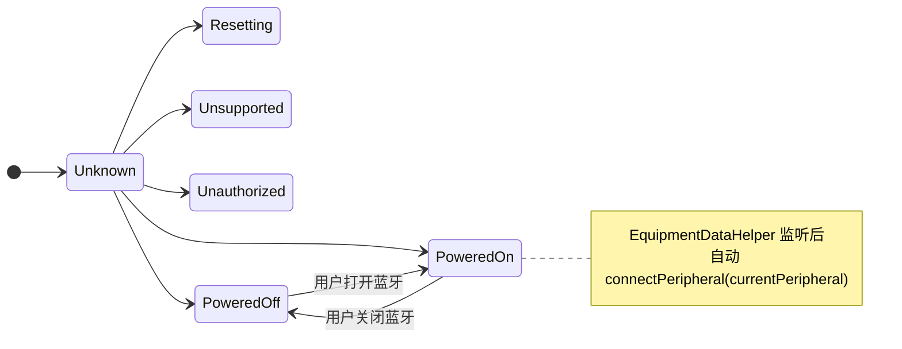
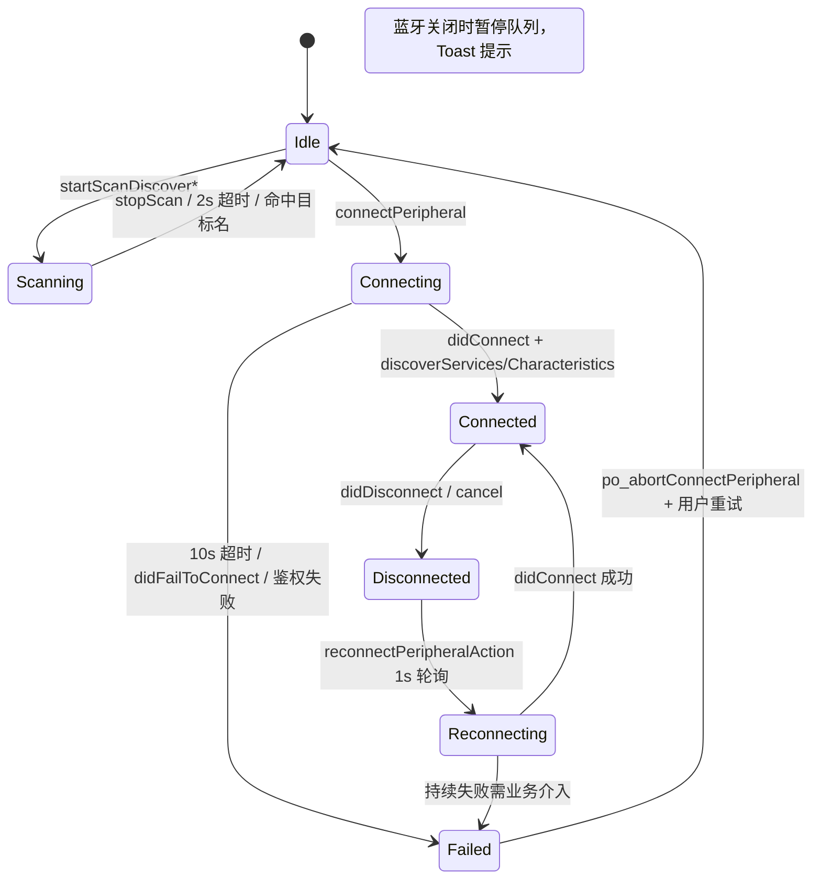
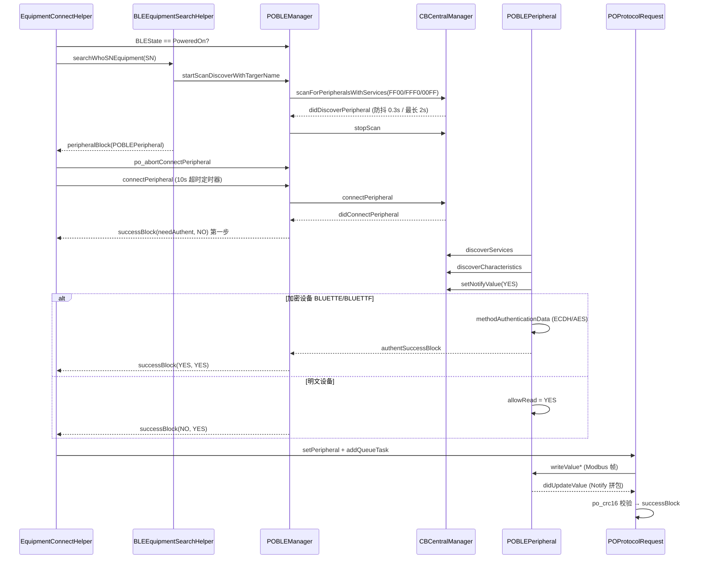

# iOS 蓝牙通信异常处理全方案

> 基于 **POModbus / Bluetti** 生产代码梳理，对应模块：`POBLEManager`、`POBLEPeripheral`、`POModbusProtocol`、`POProtocolRequest`、`EquipmentDataHelper`、`EquipmentConnectHelper`。  
> 精简对照 SDK：`poble/POBLE`（扫描/连接最小实现）。

---

## 1. 架构概览

### 1.1 分层职责

```
┌─────────────────────────────────────────────────────────────┐
│  Business（业务层）                                          │
│  EquipmentConnectHelper / EquipmentDataHelper / 各 Setting VC │
│  · 按 SN 扫描连设备 · 会话防脏回调 · 周期读数据 · 离线 UI      │
└───────────────────────────┬─────────────────────────────────┘
                            │ Delegate / NSNotification
┌───────────────────────────▼─────────────────────────────────┐
│  CommandQueue（命令队列层）                                  │
│  EBaseProtocol → POProtocolRequest                            │
│  · requestsArray 串行 · 7s 任务超时 · CRC/前缀校验 · 断线清队 │
└───────────────────────────┬─────────────────────────────────┘
                            │ writeValue* / didUpdateNotification
┌───────────────────────────▼─────────────────────────────────┐
│  ProtocolParser（协议层）                                    │
│  POModbusProtocol                                             │
│  · Modbus 0x03/0x06/0x10 组帧 · po_crc16 · Beta/TLV 解析      │
└───────────────────────────┬─────────────────────────────────┘
                            │ NSData 明文 / 解密后 Modbus 体
┌───────────────────────────▼─────────────────────────────────┐
│  BLEManager（通道层）                                        │
│  POBLEManager + POBLEPeripheral                               │
│  · CBCentralManager 扫描/连接/重连                            │
│  · CBPeripheral 发现服务特征 · Notify 订阅                    │
│  · MTU 切片发送 · 写读超时重发 · 加密粘包 tempData            │
└─────────────────────────────────────────────────────────────┘
```

### 1.2 核心类映射（学习计划 ↔ 项目）

| 学习计划概念 | 项目实现 | 路径 |
|-------------|----------|------|
| BLEManager | `POBLEManager` / `POBLEPeripheral` | `POModbus/.../POChannelTools/POBLEManager.{h,m}` |
| ProtocolParser | `POModbusProtocol` + Notify 拼包逻辑 | `POParser/POModbusProtocol.{h,m}`、`POProtocolRequest.m` |
| CommandQueue | `POProtocolRequest.requestsArray` | `POModbusProtocol/POProtocolRequest.m` |
| Business | `EquipmentDataHelper`、`EquipmentConnectHelper` | `POModbusHelper/Helper/` |

### 1.3 通道与 UUID（储能设备）

| 用途 | UUID / 说明 |
|------|-------------|
| 扫描过滤 Service | `FF00`（自有）、`FFF0`（英得尔）、`00FF`（AECC） |
| 读特征 | `FF01` / `FFF4` 等（按 `deviceType`） |
| 写特征 | `FF02` / `FFF1` 等 |
| Notify | `FF03`（ESP32 等，含 Notify 属性的特征自动订阅） |

---

## 2. 连接全流程

### 2.1 状态机图

**系统蓝牙状态（`POBLEState`）**



**业务连接状态（建议 UI 层理解；底层为 `POPeripheralState` + 扫描/重连标记）**



**底层外设四态（`POPeripheralState`）**

| 枚举 | 含义 |
|------|------|
| `Disconnected` | 未连接 |
| `Connecting` | 连接中 |
| `Connected` | GATT 已连接（加密设备还需 `allowRead == YES` 才可 Modbus） |
| `Disconnecting` | 断开中 |

### 2.2 时序图（扫描 → 连接 → 发现服务 → 通信）



### 2.3 扫描策略（项目实现）

| 要点 | 项目写法 | 常量/位置 |
|------|----------|-----------|
| Service UUID 过滤 | `scanForPeripheralsWithServices:uuidArr` | `FF00` / `FFF0` / `00FF` |
| 扫描超时 | 总时长 **2s**；有结果后 **0.3s** 无新设备则停扫 | `dScanMaxTime` / `dScanMaxInterval` |
| 目标设备 | `scanTargerName` 命中后立即 `stopScan` | `didDiscoverPeripheral` |
| 去重 | 按 **设备 name** 去重（非 identifier） | 生产按 SN 名过滤 |
| RSSI | 每次写/Notify 后 `readRSSI`，发 `PONotifiBLEByRSSI` | 连接前未硬拦截弱信号 |

**面试表述：** 「先用 Service UUID 收窄广播；扫描用防抖 + 总超时避免常驻耗电；列表按名称去重，业务上再按 SN 精确匹配。」

### 2.4 连接策略（项目实现）

| 步骤 | 实现 |
|------|------|
| 停扫 | 扫描结束回调里 `stopScan`；直连已有 `peripheral` 时不再扫 |
| 连接 | `connectPeripheral:options:nil` |
| 连接超时 | **10s**（`dConnectMaxInterval`），超时 `po_abortConnectPeripheral` |
| 防并发连接 | 已有 `dConnectTimerKey` 时返回 `100002 Connecting` |
| 发现服务 | `discoverServices` → `discoverCharacteristics` |
| 订阅 Notify | `setNotifyValue:YES`（含 `FF03` 等） |
| 就绪条件 | 明文：`allowRead=YES`；密文：鉴权成功后才可写读 |

**业务加固（`EquipmentConnectHelper`）**

- `bleConnectSessionId`：丢弃旧会话迟到回调  
- `po_abortConnectPeripheral`：失败/取消时清定时器、清半连接  
- 特征就绪再等 **10s**（非加密路径 `connectPeripheralInfoBlock`）

### 2.5 断开与重连

| 场景 | 项目策略 |
|------|----------|
| 用户主动断开 | `cancelPeripheralConnection` + `po_cancelPendingCommunication` + 从 `connectArr` 移除 |
| 意外断开 | `reconnectPeripheralAction`：**每 1s** 对 `Disconnected/Disconnecting` 设备 `connectPeripheral`（**非**指数退避） |
| 蓝牙 reopen | `EquipmentDataHelper` 在 `PoweredOn` 后 `connectPeripheral(currentPeripheral)` + `tryReadAgain` |
| App 被杀恢复 | **未实现** `retrievePeripheralsWithIdentifiers` / State Restoration |

---

## 3. 协议层

### 3.1 帧格式（Modbus RTU over BLE）

储能 App 主路径为 **Modbus**，不是通用 `0xAA55` 自定义帧。

**读请求（0x03）组帧：**

```
[从机地址 1B][功能码 0x03 1B][起始寄存器 2B 大端][寄存器数量 2B 大端][CRC16 2B]
```

实现见 `POModbusProtocol -readSegmentDataWithDevice:start:length:`，CRC 使用 `[data po_crc16]`（**CRC16-Modbus**）。

**读响应拼包规则（`POProtocolRequest`）：**

1. Notify 多次回调，`NSMutableData *aData` 累加  
2. 长度达到 `request.digit`（由寄存器数推算：`digit * 2 + 5`）  
3. 校验响应前缀与请求前两字节一致（如 `01 03`）  
4. 对 `[0 .. length-2]` 做 `po_crc16`，与尾部 2 字节比较  
5. 成功 → `successBlock` → 出队下一任务  

**加密设备额外信封（`POBLEPeripheral`）：**

```
[长度 2B][随机 4B][AES 密文 N B]  → 解密后才是 Modbus 体
```

粘包使用 `tempData`：按密文长度字段拼满一整帧再解密，半包则 `return` 等待下次 Notify。

### 3.2 发送分包（MTU）

| 项 | 说明 |
|----|------|
| MTU 来源 | 广播含 `BLUETTI` 走 `updateMTUForPeripheral`；默认 ESP32 **244**，老 iPhone **182** |
| 切片 | `writeData.length > subSize` 时按 `maximumWriteValueLengthForType` 循环 `writeValue` |
| 老设备 | `subSize <= 20` 时每片间隔 **5ms** |

### 3.3 粘包 / 半包 / 脏数据

| 类型 | 项目处理方式 |
|------|--------------|
| 半包 | `aData` 未达 `digit` 继续 append；加密 `tempData.length < 期望长度` 则等待 |
| 粘包 | 达到 `digit` 后只取前 `needDigit` 字节做 CRC；多余留给下一帧需靠前缀校验失败丢弃 |
| 脏数据 / 前缀错 | 与 `writeData` 头 2 字节不一致 → `777777` + `readErrorCount++` |
| CRC 错 | `888888` + 日志 type 4 |
| 硬件异常首字节 | `0x41`/`0x18` 剥离后再拼（`checkFirstByte`） |

### 3.4 CRC 失败处理

- **单次：** 本任务 `nextRequestBlock(NO, 888888)`，记 `POModbusLogsDBManager`  
- **需成功才继续的任务：** `needSuccess` 时 `readErrorCount > 4` 才踢出队列  
- **面试答法：** 丢弃当前帧、计数，连续失败清空队列或触发离线 UI，不无限重试脏数据  

### 3.5 超时重试 + 串行队列

**BLE 写读层（`POBLEPeripheral`）**

```
writeValue → 启动 dSendTimerKey
  → 收到 Notify/read → removeTimer 成功
  → 超时 → againTime 倍增重发（最多约 3 次有效重发）
  → againTime == 0 → error 100016 + po_clearPendingReadCallbacks
```

| 参数 | 值 |
|------|-----|
| 默认间隔 | 1.0s × 3 次 |
| iOS 11/12 | 1.5s × 4 次（`POBLENeedsExtendedReadTimeout`） |
| 大包发送 | 间隔升为 1.5s |
| `tryReread:NO` | 3.0s × 1 次，不重发 |

**协议任务层（`POProtocolRequest`）**

| 参数 | 值 |
|------|-----|
| 任务超时 | **7s** `timeoutKey` → `999999` |
| 串行 | `isRequesting` + 完成后才 `startRequestLAN` |
| 断线 | `checkConnectStatus` 清空 `requestsArray` |

### 3.6 「心跳」与离线检测（项目等价方案）

未使用独立 `0x01` 心跳包，而用 **周期 Modbus 读 + 连接态轮询** 代替：

| 机制 | 位置 | 作用 |
|------|------|------|
| 1s 连接轮询 | `POBLEManager` `POBLE_Loop_checkDisconnect_Peripheral` | 断线自动 `connectPeripheral` |
| 周期读数据 | `EquipmentDataHelper` `loadEquipmentMsgData` / `dataInterval` | 业务存活与 UI 刷新 |
| 协议僵死 | `protocolMaybeDeadWithRequest:` | 1.6s 后重新 `loadEquipmentMsgData` |
| 离线判定 | `EBaseProtocol.isDisconnect` | `!Connected \|\| !allowRead` → Toast 离线 |
| 队列断线 | `protocolDidDisconnectWithRequest:` | 刷新连接状态 UI |

**前台恢复：** `tryReadAgain` → 延迟 `loadEquipmentMsgData`，等效「回前台立即拉一次数据确认链路」。

---

## 4. 异常处理矩阵（核心）

### 4.1 连接失败（一直 Connecting / 连不上）

| 维度 | 内容 |
|------|------|
| **现象** | HUD「连接中」、10s 后超时 Toast、`100002` 提示已有设备在连 |
| **常见原因** | 蓝牙未开/无权限；设备被他人占用；未停扫资源竞争；RSSI 过弱；加密设备未配对（`ancsAuthorized`） |
| **排查步骤** | ① `POBLEState` ② Info.plist 蓝牙权限 ③ 是否重复 `connectPeripheral` ④ RSSI 通知 ⑤ 扫描是否已 `stopScan` ⑥ 是否 `BLUETTE` 需系统配对 |
| **兜底方案** | `connectingIsTimeoutAction` → `po_abortConnectPeripheral`；`EquipmentConnectHelper` 会话 ID 忽略脏回调；引导用户靠近/重试/删除系统蓝牙配对 |

**项目错误码：**

| Code | Domain | 说明 |
|------|--------|------|
| 100001 | Connect | 无外设 |
| 100002 | Connecting | 已有连接进行中 |
| 100003 | Timeout | 连接 10s 超时 |
| 100014 | No Permission | 加密鉴权失败 |

### 4.2 设备离线（已连但无数据 / UI 显示离线）

| 维度 | 内容 |
|------|------|
| **现象** | `E_Main_offline`、主页数据不刷新、控制无响应 |
| **常见原因** | 心跳等价读失败；设备断电；距离远 GATT 断开；加密 `allowRead==NO`；队列因断线被清空 |
| **排查步骤** | ① `peripheral.state` + `allowRead` ② `protocolDidDisconnect` 是否触发 ③ 日志是否有 `Task Request Timeout` ④ `reconnectPeripheralAction` 是否在跑 |
| **兜底方案** | `protocolMaybeDead` 重拉数据；1s 自动重连；`po_cancelPendingCommunication` 避免脏回调；用户侧提示检查设备电源与距离 |

### 4.3 数据错乱（CRC / 前缀 / 解析失败）

| 维度 | 内容 |
|------|------|
| **现象** | `Config_Tips_receiveTips`、日志 `Error CRC` / `Error Prefix`、字段解析为空 |
| **常见原因** | Notify 半包未拼完就校验；多指令并发（本项目队列已串行）；字节序/协议版本不一致；加密 `tempData` 长度算错 |
| **排查步骤** | ① `POModbusLogsDBManager` type 2/3/4 ② `readErrorCount` ③ MTU 是否过小导致多分片 ④ Beta 协议 plist 与固件版本 |
| **兜底方案** | 丢弃坏帧；`readErrorCount` 超限出队；必要时 `disconnect` + 重连；勿对脏数据无限重发 |

### 4.4 蓝牙被关（PoweredOff）

| 维度 | 内容 |
|------|------|
| **现象** | `BLE_Connect_HUB_off`、无法扫描连接 |
| **原因** | 系统蓝牙关闭或短暂 Resetting |
| **排查** | `centralManagerDidUpdateState` → `POBLEState` |
| **兜底** | 暂停 `startRequestLAN`；UI Toast；`PoweredOn` 后 `EquipmentDataHelper` 自动重连 + `tryReadAgain` |

### 4.5 配对问题（Peer Removed Pairing / 加密鉴权失败）

| 维度 | 内容 |
|------|------|
| **现象** | `100014`、`CBErrorPeerRemovedPairingInformation`、iOS13+ `ancsAuthorized == NO` |
| **原因** | 系统蓝牙配对信息丢失；加密芯片需重新配对 |
| **排查** | 设置 → 蓝牙 → 删除设备；重连是否走 `cancelPeripheralConnection` 清加密态 |
| **兜底** | 引导用户删除系统配对后重连；`po_abortConnectPeripheral` 清 `secretFirstKey` / `allowRead` |

### 4.6 系统 CBError 速查（面试常问）

| CBError | 原因 | 处理 |
|---------|------|------|
| `CBErrorConnectionTimeout` | 连接超时 | 停扫、靠近、重试；对齐项目 10s 定时器 |
| `CBErrorPeerRemovedPairingInformation` | 配对信息被删 | 系统设置删设备重配 |
| `CBErrorConnectionFailed` | 链路失败 | 检查是否被其他 App 连接、重启蓝牙 |
| `CBErrorPeripheralDisconnected` | 已断开 | 走重连流程，清队列 |
| `CBErrorOperationCancelled` | 主动 cancel | 区分用户取消与超时 abort |
| `CBErrorEncryptionTimedOut` | 加密握手超时 | 加密机型重连、检查配对 |
| `CBErrorUnauthorized` | 无蓝牙权限 | Info.plist + 引导授权 |
| `CBErrorBluetoothPowerOff` | 蓝牙关闭 | 监听 State，恢复后再连 |
| `CBErrorUnknown` | 未知 | 打日志 domain/code，重试一次 |

---

## 5. 后台保活

### 5.1 已配置项（宿主 `bluetti/Bluetti/Info.plist`）

```xml
<key>UIBackgroundModes</key>
<array>
    <string>bluetooth-central</string>
    ...
</array>
```

`POBLEManager` 初始化使用 `CBCentralManagerOptionShowPowerAlertKey`。

### 5.2 代码现状与缺口

| 能力 | 状态 |
|------|------|
| `bluetooth-central` | ✅ 已声明 |
| Notify 唤醒 | ✅ 订阅后设备推送可进 `didUpdateValueForCharacteristic` |
| State Restoration | ❌ 未传 `CBCentralManagerOptionRestoreIdentifierKey` |
| `willRestoreState:` | ❌ 未实现 |
| 后台常驻心跳 | ❌ 不应实现；依赖系统短暂唤醒 + 前台 `tryReadAgain` |

### 5.3 推荐补全代码片段（学习与后续迭代）

```objc
// 初始化
self.centralManager = [[CBCentralManager alloc]
    initWithDelegate:self
    queue:dispatch_get_main_queue()
    options:@{
        CBCentralManagerOptionShowPowerAlertKey: @(YES),
        CBCentralManagerOptionRestoreIdentifierKey: @"com.bluetti.ble.central"
    }];

// 恢复回调
- (void)centralManager:(CBCentralManager *)central willRestoreState:(NSDictionary<NSString *, id> *)dict {
    NSArray<CBPeripheral *> *peripherals = dict[CBCentralManagerRestoredStatePeripheralsKey];
    // 取回 peripheral，重新设 delegate，必要时 connectPeripheral
}
```

### 5.4 后台保活说明（约 300 字，可直接贴文档）

储能 App 在宿主工程中开启 `bluetooth-central`，允许在后台维持中心角色并在设备通过 BLE Notify 上报数据时短暂唤醒 App 处理 `didUpdateValueForCharacteristic`。通道层 `POBLEManager` 在连接后订阅 Notify，协议层 `POProtocolRequest` 在收到完整 Modbus 帧后解析业务数据。需要明确：**iOS 不允许 App 在后台长期执行定时心跳**；本项目以前台/回前台后的 `loadEquipmentMsgData` 与 1s 断线重连轮询保证链路可用，而非 30s 自定义心跳包。App 被系统回收后，当前代码**尚未**使用 `CBCentralManagerOptionRestoreIdentifierKey` 与 `willRestoreState:` 恢复 GATT 连接，蓝牙重新打开时由 `EquipmentDataHelper` 在 `PoweredOn` 后对 `currentPeripheral` 发起重连。后续若要加强后台连续性，应补 State Restoration，并继续依赖 Notify 推送 + 前台立即补读，而不是后台轮询 Modbus。

### 5.5 自测清单（Day 12–13）

- [ ] 真机：连设备后进后台 5 分钟，设备主动上报能否写入日志 DB  
- [ ] 杀进程重启：观察是否需用户手动回设备页重连（验证 Restoration 缺口）  
- [ ] 回前台：是否触发 `tryReadAgain` / 数据恢复刷新  

---

## 6. 项目亮点（简历用）

以下为与**真实代码一致**的表述；带 `%` 的指标需你补线上数据后再写。

1. **负责储能设备 BLE + Modbus 通信通道**（`POBLEManager` / `POProtocolRequest`），实现 GATT 多机型 UUID 适配、**MTU 自适应分包发送**、Notify **半包/粘包拼接**、**CRC16-Modbus 校验**及加密机型 **AES 帧重组**，支撑参数读写、OTA、并联多机连接管理。

2. **设计协议层串行命令队列 + 双层超时重试**（队列 7s 任务超时 + BLE 写读 1s×3 重发），避免多 Modbus 指令并发导致响应乱序；连接层 **10s 超时 abort** 与 **会话 ID 防脏回调**，提升弱网/加密配对场景下的连接成功率。（*可填：通信成功率从 X% 提升至 Y%*）

3. **实现断线 1s 轮询自动重连与蓝牙 reopen 恢复读**（`reconnectPeripheralAction`、`EquipmentDataHelper`）；宿主已配置 **`bluetooth-central`**，设备 Notify 可后台唤醒处理；*State Restoration 为明确可迭代点，面试可说明方案与现状*。

### 6.1 与学习计划差异（面试诚实表述）

| 学习计划 | 项目现状 | 说法 |
|----------|----------|------|
| 指数退避重连 | 固定 1s 轮询 | 「生产用简单重连，了解退避算法，可按场景升级」 |
| 15s 连接超时 | 10s | 「按业务 HUD 体验定为 10s」 |
| 独立心跳包 | 周期 Modbus 读 + 连接轮询 | 「业务层用读请求保活，更符合储能数据刷新需求」 |
| 0xAA55 帧头 | Modbus RTU | 「协议栈是 Modbus over BLE，粘包逻辑在拼包长度与 CRC」 |
| State Restoration | 未落地 | 「plist 已开 central，代码恢复是下一步」 |

---

## 附录 A：CoreBluetooth 回调对照表

| 回调 | 实现类 | 作用 |
|------|--------|------|
| `centralManagerDidUpdateState:` | `POBLEManager` | → `POBLEState`，通知 Delegate/Block |
| `didDiscoverPeripheral:...` | `POBLEManager` | 封装 `POBLEPeripheral`，去重/命中 SN |
| `didConnectPeripheral:` | `POBLEManager` | 取消连接定时器，进入 GATT |
| `didFailToConnectPeripheral:` | `POBLEManager` | 错误回调 + abort |
| `didDisconnectPeripheral:` | `POBLEManager` | 清通信定时器、回调 UI |
| `didDiscoverServices:` | `POBLEPeripheral` | 按机型发现特征 |
| `didDiscoverCharacteristicsForService:` | `POBLEPeripheral` | 绑定读写 Notify，`allowRead` |
| `didUpdateValueForCharacteristic:` | `POBLEPeripheral` | 拼包/解密/转发 Delegate |
| `didWriteValueForCharacteristic:` | `POBLEPeripheral` | 写结果、清超时 |
| `didReadRSSI:` | `POBLEPeripheral` | `PONotifiBLEByRSSI` |

## 附录 B：学习打卡（对应 2.2–2.7 阶段）

| 阶段 | 建议动作（读你项目即可） |
|------|-------------------------|
| 第 1 阶段 | 对照 `poble/Example` + `POBLEManager.h` 手写回调表 |
| 第 2 阶段 | 跟读 `EquipmentConnectHelper` 192–350 行 + 画本文档时序图 |
| 第 3 阶段 | 精读 `POProtocolRequest` 394–700 行 + `POBLEPeripheral` `needWriteValue` |
| 第 4 阶段 | 真机后台测试 + 补 Restoration 学习笔记 |
| 第 5 阶段 | 背异常矩阵 + 简历 3 条 bullet |

---

*文档版本：2026/6/4 · 作者梳理：lvyazhou · 代码基线：pomodbus `POBLEManager` / `POProtocolRequest`*
