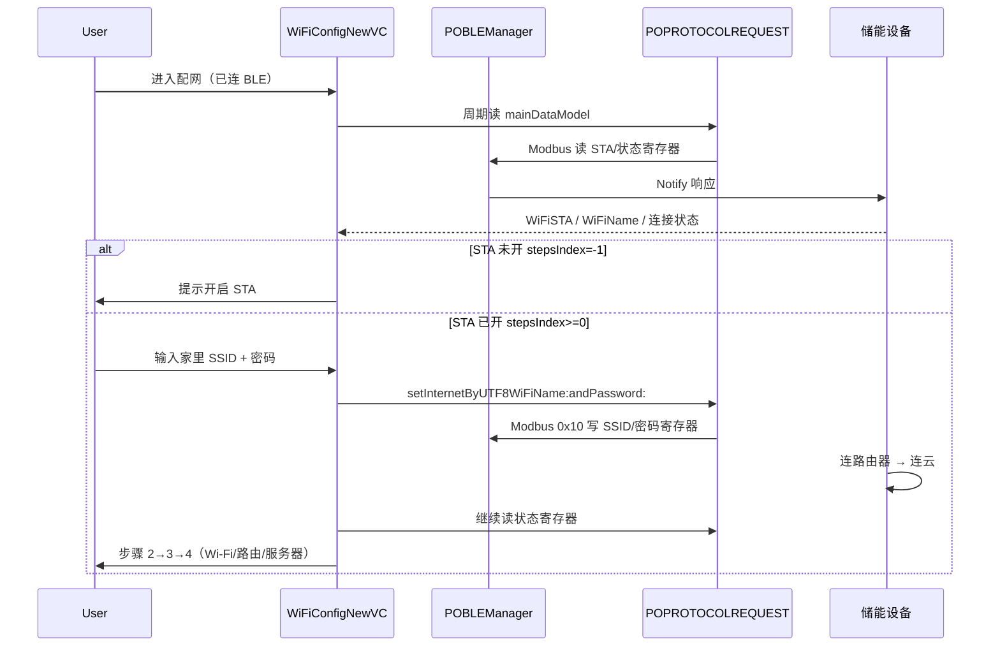

# iOS WiFi 配网全方案（SoftAP / SmartConfig / BLE）

> 结合 **POModbus / Bluetti** 生产实现 + IoT 通用方案对比。  
> 配套 Demo：[BLEWiFiDemo/](./BLEWiFiDemo/)（含 [Demo-Guide.md](./BLEWiFiDemo/Demo-Guide.md) 3 分钟脚本）  
> 蓝牙文档：[iOS-BLE-Exception-Handling.md](./iOS-BLE-Exception-Handling.md)

---

## 1. 两种方案对比（先建立认知）

| 方案 | 原理 | 优点 | 缺点 | iOS 实现难度 |
|------|------|------|------|--------------|
| **SoftAP** | 设备开热点，手机连热点，App 经局域网 POST SSID/密码 | 稳定、成功率高 | 需用户手动连 WiFi | 中 |
| **SmartConfig（ESPTouch 等）** | 手机 UDP 广播编码 WiFi 信息，设备混杂模式监听解码 | 用户无感 | 成功率受路由器/5G 影响 | 低（用 SDK） |
| **BLE 传配网信息（本项目主路径）** | 手机已 BLE 连接，Modbus 写寄存器下发 SSID/密码 | 无需切热点、与储能 App 流程一致 | 依赖蓝牙连接稳定 | 中（已有通道） |

储能 / IoT 常见组合：

- **Bluetti 储能 App**：**BLE + Modbus 写 Wi-Fi 寄存器** → 设备侧 STA 连路由器 → App **轮询寄存器状态**（非 SoftAP 主路径）。
- **ESP 类开发板 / 部分竞品**：SoftAP + HTTP `192.168.4.1`，或 SmartConfig 作备选。

---

## 2. 本项目实际配网路径（必读）

### 2.1 与通用 SoftAP 的差异

| 环节 | 通用 SoftAP | Bluetti / POModbus |
|------|-------------|-------------------|
| 前置连接 | 连设备 AP `ESP_XXXX` | **先 BLE 连接**（`EquipmentConnectHelper`） |
| 下发方式 | HTTP POST `192.168.4.1` | **Modbus 写** `setInternetByUTF8WiFiName:andPassword:` |
| 进度展示 | HTTP 响应 | **读寄存器**：STA 开关、WiFi 名、路由/云连接状态 |
| 入口 VC | 自定义 Web/原生 | `WiFiConfigNewViewController` 步骤机 |

### 2.2 BLE 配网时序（生产）



### 2.3 步骤机（`WiFiConfigNewViewController`）

| stepsIndex | 含义 |
|------------|------|
| -1 | 监听 STA **未**开启 |
| 0 | STA **已**开启 |
| 1 | 编辑 Wi-Fi 信息 |
| 2 | 监听 Wi-Fi 连接（名称匹配） |
| 3 | 监听路由器连接 |
| 4 | 监听服务器连接 |
| 5 / 6 | 更换网络 / 新配置完成 |

核心写网代码（`ESettingRequest.m`）：

```objc
// UTF-8 SSID + 密码 → Modbus 多寄存器写
[POPROTOCOLREQUEST setInternetByUTF8WiFiName:wifiName
                                  andPassword:password
                                 successBlock:...
                                   errorBlock:...];
```

旧版入口：`WiFiConfigurationSetViewController` → `connectWifi:wifiPassword:` 同样走上述 API。

### 2.4 业务入口

- 绑定 / 设置：`EquipmentConnectHelper` → `EConnectToSystemConfig` → `WiFiConfigNewViewController`
- 多网口：`WiFiConfigMostNetViewController`
- AECC：`AECCWiFiConfigurationSetViewController`

---

## 3. SoftAP 配网流程（建议主攻 · 面试 / ESP 硬件）

### 3.1 标准流程

```
1. 用户长按设备键 → 设备进入配网模式（开 AP，如 ESP_XXXX）
2. App 引导：系统设置 → 连接设备热点
3. App 检测当前 SSID == 设备热点名 → 进入配网页
4. 用户输入家里 WiFi 名 + 密码
5. App 向设备固定 IP（如 192.168.4.1）POST 配网信息
6. 设备连路由器 → 返回成功
7. App 提示：请切回正常 WiFi
8. （可选）BLE / 云端轮询设备是否上线
```

### 3.2 iOS 关键点

| 项 | 说明 |
|----|------|
| `NEHotspotConfiguration` | iOS 11+ 可编程连 WiFi；**连设备 AP 多数仍需用户手动** |
| 当前 SSID | `CNCopyCurrentNetworkInfo` 或 `NEHotspotNetwork`；需 **定位权限**（iOS 13+） |
| Local Network | iOS 14+ 访问 `192.168.4.1` 需在 Info.plist 声明 `NSLocalNetworkUsageDescription` + Bonjour 服务类型（如 `_http._tcp`） |
| 蜂窝与 WiFi | 连设备 AP 后请求可能走蜂窝，需引导关蜂窝或确保走 Local Network |

### 3.3 踩坑清单（必背 3 条 + 扩展）

| # | 踩坑 | 原因 | 处理 |
|---|------|------|------|
| 1 | 连上设备 AP 后 POST 超时 | 流量走了 **蜂窝** 而非 WiFi | 提示关蜂窝 / 检查 Local Network 权限；用 **IP 不用域名** |
| 2 | `192.168.4.1` 访问被拒 | iOS 14+ **本地网络隐私** 未声明 | Info.plist 补 `NSLocalNetworkUsageDescription` |
| 3 | 配网成功后 App 无响应 | 设备 AP **关闭**，手机 WiFi 断开 | 提前文案：「配网成功后将断开热点，请切回家里 WiFi」 |
| 4 | SSID 读不到 | 未授权 **定位** | `CLLocationManager` + When In Use |
| 5 | HTTPS 证书失败 | 设备自签证书 | 开发阶段用 HTTP 或证书 pinning 策略 |

Demo 中 `BWSoftAPProvisioner` 用 **Mock URLSession** 模拟 POST 成功/失败，无硬件也可演示流程。

---

## 4. SmartConfig 流程（了解即可）

```
1. 手机连家里 WiFi
2. App 获取当前 SSID + 用户输入密码
3. 调用 ESPTouch 等 SDK，UDP 广播编码包
4. 设备混杂模式监听，解码后连 WiFi
5. SDK 回调设备 MAC/IP 表示成功
```

| 项 | 说明 |
|----|------|
| SDK | 乐鑫 `ESPTouch`、`ESPProvision` 等 |
| 限制 | 5GHz 仅、隐藏 SSID、企业级 WPA 可能失败 |
| 与储能 App | 作 **备选方案** 口述即可；本项目未作主路径 |

---

## 5. 三种路径选型表（面试）

| 场景 | 推荐 |
|------|------|
| 已有 BLE 且协议成熟（储能） | **BLE 写寄存器** + 状态轮询 |
| ESP 初配、无 BLE | **SoftAP + HTTP** |
| 追求一键、路由器简单 | **SmartConfig**（SDK） |
| 成功率优先 | SoftAP > BLE 写寄存器 > SmartConfig |

---

## 6. 与 BLE 文档的衔接

| 能力 | BLE 文档 | 本文 |
|------|----------|------|
| 扫描连接 | `POBLEManager` | 配网前置条件 |
| 命令队列 | `POProtocolRequest` | `setInternetByUTF8*` 走同一队列 |
| 离线重连 | 1s 轮询 + `tryReadAgain` | 配网中断线需重新连 BLE 再写 |

---

## 7. 学习打卡（Day 16–18）

- [ ] 读懂 `WiFiConfigNewViewController` 的 `stepsIndex` 与 `loadCellRegisterView`
- [ ] 跟一次 `setInternetByUTF8WiFiName:andPassword:` → `ESettingRequest` 寄存器地址
- [ ] 画一张 **BLE 配网** 时序图（本文 2.2）
- [ ] 画一张 **SoftAP** 时序图（本文 3.1）
- [ ] 背诵踩坑 3 条（§3.3 表 #1–#3）
- [ ] 跑 `BLEWiFiDemo`：连接 Mock 设备 → 读数据 → 配网页 Mock POST

---

## 8. 简历表述（WiFi 相关）

- 负责储能设备 **BLE 配网模块**，基于 Modbus 写 **SSID/密码寄存器** + 多步骤状态机轮询 STA/路由/云端连接，支撑绑定与换网场景。  
- 熟悉 **SoftAP / SmartConfig** 原理与 iOS 本地网络、定位权限等限制，可按设备能力选型配网方案。  

---

*文档版本：2026/6/4 · 代码基线：pomodbus `WiFiConfiguration` / `ESettingRequest`*
